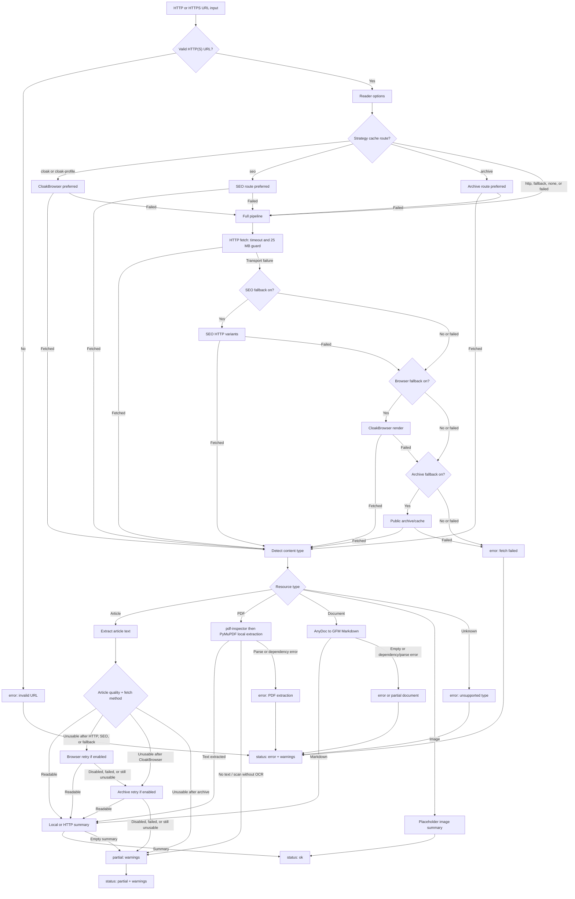
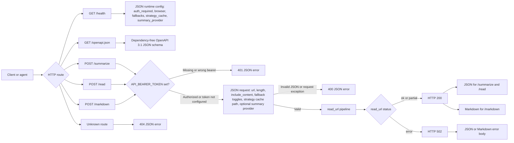

# Supersocks URL Scraper

[](pyproject.toml)
[](pyproject.toml)
[](LICENSE)
[](https://github.com/iamsupersocks/supersocks-url-scraper)

> **Turn a URL into usable context.**

Give the package an HTTP(S) URL and get back a small JSON or Markdown contract with the title, content type, readable summary, selected fetch route, and warnings when the read is partial.

🌐 [Repository](https://github.com/iamsupersocks/supersocks-url-scraper) · 🧩 JSON + Markdown · 🔒 Local-first by default · 📄 MIT

It starts dependency-light for normal pages, then can opt into article/PDF extraction, office-document Markdown via AnyDoc, local pdf-inspector classification, CloakBrowser rendering, public archive/cache lookups, a metadata-only routing strategy cache, and a tiny HTTP service. It is not a hosted bypass service and ships no credentials, browser profiles, vendor-specific LLM SDK, or universal paywall guarantee.

## Quick start

**Publication status:** PyPI and the npm registry do not host `supersocks-url-scraper@0.2.0` yet (both return 404). Until registry publishes happen, install from a GitHub checkout, pipx, or a packed npm tarball — not from `pip install` / `npx` against the public registries.

Python (from GitHub with pipx today):

```bash
pipx install 'git+https://github.com/iamsupersocks/supersocks-url-scraper.git'

supersocks-url-scraper --include-content --length 1200 https://example.com/article
```

Optional Python extras (`full`, `browser`, `youtube`, …) are not bundled by default; install them explicitly into the pipx/venv environment when needed (see [Install](#install)).

npm launcher (install from this checkout today; registry publish is future):

```bash
# Future (after npm publish):
# npx supersocks-url-scraper https://example.com/article
# npm install -g supersocks-url-scraper

# Today, from this repository:
npm pack
npm install -g ./supersocks-url-scraper-0.2.0.tgz
supersocks-url-scraper https://example.com/article
```

The npm launcher bootstraps the **base** Python engine offline from the embedded package. Optional extras for article/PDF extraction, CloakBrowser, and YouTube are **not** auto-installed; add them explicitly to the versioned cache venv if needed (see [Install](#install)).

Optional HTTP service:

```bash
supersocks-url-scraper --serve --host 127.0.0.1 --port 8768
curl -s http://127.0.0.1:8768/summarize \
  -H 'content-type: application/json' \
  -d '{"url":"https://example.com/article","length":900}'
```

## Features

- No required third-party runtime dependencies for the basic reader.
- Optional extras for high-quality article extraction, PDF parsing, and office-document Markdown.
- Optional `youtube`/`social` extras for public YouTube metadata and subtitle extraction via yt-dlp (no media download; never auto-installed).
- CLI one-shot mode.
- Optional HTTP service with `/health`, `/summarize`, `/read`, and `/markdown`.
- Detects articles, PDFs, office documents (DOCX and other AnyDoc formats), images, and unknown binary content.
- Extensible social routing for YouTube, LinkedIn, X (twitter-cli), plus Cloak-first Reddit/Instagram/Facebook (OpenCLI/rdt-cli opt-in only), with actionable missing-backend warnings and no cookie/token collection.
- Extracts from:
  - OpenGraph/Twitter/HTML metadata
  - JSON-LD article objects
  - trafilatura/readability/BeautifulSoup when optional article extras are installed
  - readable `<p>` paragraphs or regex fallback without extras
- PDF text extraction via optional pdf-inspector + PyMuPDF (local OSS only; no cloud OCR).
- Office/document conversion to GitHub-Flavored Markdown via optional `firecrawl-anydoc` (`documents` extra).
- Deterministic placeholder descriptions for images when no vision model is configured.
- SEO-style HTTP fallback variants: Googlebot, Bingbot, Google/Facebook/t.co referers.
- Optional browser/Cloak fallback for hostile media when the `browser` extra is installed.
- Recognized consent dialogs are dismissed through an explicit reject/continue-without-accepting control before browser extraction.
- Layered fallback pipeline: HTTP → SEO variants → CloakBrowser → public archive/cache snapshots, including retry when HTTP returns only a teaser/paywall/cookie wall.
- Optional per-domain JSON strategy cache storing only routing metadata.
- Optional opt-in API recipes (HTTPS GET, host-allowlisted, versioned) for structured agent outputs; Flashscore 1X2 example is consent-gated and off by default (ToS). Degrade to HTTP→SEO→Cloak→archive on failure. Off by default. Offline HAR discovery (`--discover-har`) classifies a local capture and emits a disabled `review_required` candidate recipe; embedded JSON Schema v1 + `--validate-recipe` validate recipe files offline. Optional `route_advice` / `--recurrent` steers agents toward known recipes or manual HAR + offline discovery — no auto-sniff, no auto-activation.
- Markdown output.
- Returns warnings for partial extraction, boilerplate, paywalls, and placeholders.
- Safe to run locally or in cron/server contexts.

## Architecture diagrams

### URL read pipeline



### HTTP service contract



## Limitations

The basic scraper intentionally starts without a browser. With `browser_fallback` disabled or without the `browser` extra installed, it may return partial or boilerplate content for:

- JavaScript-heavy pages
- login walls
- cookie walls
- bot checks / CAPTCHA pages
- social sites that hide content from simple HTTP clients

When that happens, check the `status` and `warnings` fields.

## Install

### Python (pip / pipx)

**PyPI:** not published yet — `pip install supersocks-url-scraper` returns 404 until a release is uploaded.

From GitHub with pipx (recommended today):

```bash
pipx install 'git+https://github.com/iamsupersocks/supersocks-url-scraper.git'
# Optional extras require explicit install, e.g. after pipx install:
# pipx inject supersocks-url-scraper 'PyMuPDF>=1.24' 'firecrawl-anydoc>=0.1.3,<0.2' 'pdf-inspector>=0.2' 'trafilatura>=1.12' ...
```

Or from a local checkout:

```bash
python -m venv .venv
. .venv/bin/activate
pip install -e .
# Optional extras on a checkout:
# pip install -e '.[documents,pdf,test]'
# pip install -e '.[full,test]'
# pip install -e '.[full,browser]'
# pip install -e '.[youtube]'
```

Future (after PyPI publish):

```bash
# pip install supersocks-url-scraper
# pip install 'supersocks-url-scraper[documents]'
# pip install 'supersocks-url-scraper[full]'
# pip install 'supersocks-url-scraper[full,browser]'
# pip install 'supersocks-url-scraper[youtube]'
# pip install 'supersocks-url-scraper[social]'
```

> **Important:** for the best paywall / anti-bot results, install the `browser` extra or use the default Docker image. Without CloakBrowser, the tool still works for normal sites but cannot perform the browser-rendered fallback that handles many 403s, bot walls, and paywall-heavy publishers.

### npm (Node launcher, version 0.2.0)

The repository ships a zero-dependency Node bin that bootstraps an isolated Python >=3.10 venv under `XDG_CACHE_HOME/supersocks-url-scraper` (or `~/.cache/supersocks-url-scraper`) from the **embedded** Python package inside the npm tarball. No `postinstall`, no remote GitHub/curl install, and no sudo.

**Publication status:** `package.json` is prepared for the npm name `supersocks-url-scraper@0.2.0`, but **`npm publish` has not been executed**. Until a registry publish happens, install from a packed tarball or path — do not expect `npx supersocks-url-scraper` to resolve from the public registry yet.

```bash
# Future (after npm publish):
# npx supersocks-url-scraper https://example.com/article
# npm install -g supersocks-url-scraper

# Today, from this checkout:
npm pack
npm install -g ./supersocks-url-scraper-0.2.0.tgz
# or one-shot without a global install:
npx --yes ./supersocks-url-scraper-0.2.0.tgz https://example.com/article
```

Requirements for the launcher: Node >=18 and Python >=3.10 on `PATH` (or set `PYTHON=`). Optional Python extras (`full`, `browser`, `youtube`, …) are not auto-installed by the npm launcher; install them into the versioned cache venv manually if needed.

## CLI usage

```bash
supersocks-url-scraper https://example.com/article
```

With longer summary:

```bash
supersocks-url-scraper --length 1500 https://example.com/article
```

Include cleaned page content:

```bash
supersocks-url-scraper --include-content https://example.com/article
```

Markdown output:

```bash
supersocks-url-scraper --markdown --include-content https://example.com/article
```

Use an optional metadata-only per-domain strategy cache:

```bash
supersocks-url-scraper --strategy-cache ./fetch-strategies.json https://example.com/article
```

Enable optional browser fallback for hostile media, JavaScript-heavy pages, consent walls, bot checks, and soft paywalls. This is the recommended mode for paywall-heavy use:

```bash
supersocks-url-scraper \
  --browser-fallback \
  --browser-post-load-wait-ms 10000 \
  https://js-heavy-publisher.example/articles/rendered-story
```

Agent guidance: start with the normal route. If the result is `error` or
`partial` and its warnings mention a 403, JavaScript, or a consent wall, retry
with `browser_fallback=true`. The browser route only dismisses recognized
consent dialogs through an explicit reject or continue-without-accepting
control. If the result remains `partial`, route the URL elsewhere instead of
asking the agent to click arbitrary page controls.

Without the `browser` extra, normal HTTP/SEO/archive routes still work, but browser-only publisher categories can fail, return only boilerplate/teasers, or become much slower.

By default the CLI also tries public archive/cache snapshots as a last resort, including when a publisher returns HTTP 200 but extraction detects only a subscriber teaser/cookie wall. Disable that with:

```bash
supersocks-url-scraper --no-archive-fallback https://example.com/article
```

### PDFs and office documents

Optional documentary extraction stays out of the base install (no required deps).

- **Office documents** (`doc`/`docx`, `ppt`/`pptx`, `xls`/`xlsx`, ODT/ODS/ODP, RTF, EPUB, CSV): install the `documents` extra (`firecrawl-anydoc`). Bytes convert to GitHub-Flavored Markdown; `content_type` is `document` and `document_format` carries the detected format.
- **PDFs**: `pdf-inspector` classifies (`text_based` / `scanned` / `image_based` / `mixed`) and extracts textual PDFs locally; **PyMuPDF** remains the compatibility fallback (`pdf` extra`). Scanned/image-based PDFs without a text layer return `partial` with classification and an explicit warning that no local OCR is configured. Provenance fields: `extraction_engine`, `document_format`, `pdf_classification`, `ocr_used` (always false), `ocr_provider` (always null).

```bash
pip install -e '.[documents,pdf]'
supersocks-url-scraper https://files.example/report.pdf
# Cap pages with DOCUMENT_MAX_PAGES / --document-max-pages
```

### Social routing (YouTube / LinkedIn / X / Instagram / Facebook / Reddit)

Social routing is inspired by the channel/backend pattern popularized by [Agent Reach](https://github.com/Panniantong/Agent-Reach) (MIT). This repository adapts that idea minimally and does **not** vendor Agent Reach, copy its package, ship ZIP installs, or invent fake PyPI extras for upstream CLIs.

- **YouTube** (`youtube.com`, `youtu.be`): when the optional `youtube`/`social` extra is installed, metadata and available subtitles/auto-captions are extracted with `yt-dlp` (`fetch_method=yt-dlp`, `platform=youtube`) without downloading media. If yt-dlp is missing, the reader warns and falls back to the generic HTTP pipeline.
- **LinkedIn** (`linkedin.com`): uses a specialized **public guest** extractor first. It classifies common public paths (`/in/`, `/company/`, `/school/`, `/showcase/`, `/jobs/view/` and jobs-guest variants, `/pulse/`/`/articles/`, `/posts/`/`/feed/update/`), prefers Open Graph/meta, valid JSON-LD, and stable guest selectors, and may add backward-compatible fields `linkedin_page_type` and `structured_data`. Auth walls, security challenges, navigation/CTA shells, and too-poor useful content return `status=partial` with an explicit warning — never `ok`. The generic HTTP/SEO/Cloak/archive pipeline and the opt-in Jina Reader fallback run only as last resorts. Jina is off by default and blocked for credentialed URLs, localhost/private hosts, and non-HTTP(S) schemes. No cookies, tokens, Voyager private APIs, login browsers, proxies, or caller headers are used or forwarded. Successful Jina reads set `fetch_method=jina` and warn `external reader used: jina`.
- **X / Twitter** (`x.com`, `twitter.com`): optional local backend via upstream [twitter-cli](https://github.com/public-clis/twitter-cli) (`fetch_method=twitter-cli`, `platform=x`). Requires the `twitter` binary on `PATH` **and** explicit `TWITTER_AUTH_TOKEN` + `TWITTER_CT0` already set in the process environment. This package never auto-reads browser cookies, never prints/stores tokens, and returns actionable warnings when the tool or credentials are missing.
- **Reddit / Instagram / Facebook** (**Cloak-first**): render with CloakBrowser (`fetch_method=cloak` or `cloak-profile`, `platform=reddit|instagram|facebook`), then extract title/text/author/published_at from HTML meta + stable selectors. Requires the `browser` extra. Optional persistent profile via `browser_profile_dir`, `SOCIAL_BROWSER_PROFILE_DIR`, or `BROWSER_PROFILE_DIR` (cookies stay inside that operator-owned directory only). Default is headless; headed mode uses an existing `DISPLAY`/`WAYLAND_DISPLAY` / operator-managed Xvfb (`CLOAK_HEADLESS=0`) and **never** installs or starts Xvfb. Login/MFA/CAPTCHA/consent blocks return `partial`/`error` with actionable warnings — never pretended success, never automated.
- **OpenCLI** (Instagram/Facebook) and **rdt-cli** (Reddit) are **opt-in desktop fallbacks only** (`SOCIAL_OPENCLI_FALLBACK=1`, `RDT_CLI_FALLBACK=1`). They are never automatic by default, never auto-installed, and never auto-read cookies.

```bash
# YouTube (requires optional yt-dlp extra)
supersocks-url-scraper --include-content https://www.youtube.com/watch?v=EXAMPLEVIDEO01

# LinkedIn specialized public extraction; optional Jina only when explicitly requested
supersocks-url-scraper --jina-fallback https://www.linkedin.com/pulse/example-public-post

# X (requires twitter-cli + explicit env credentials; never auto-reads cookies)
export TWITTER_AUTH_TOKEN='…' TWITTER_CT0='…'
supersocks-url-scraper https://x.com/example/status/1234567890

# Cloak-first social (requires browser extra; profile optional)
pip install 'supersocks-url-scraper[browser]'
supersocks-url-scraper https://www.reddit.com/r/announcements/
supersocks-url-scraper https://www.instagram.com/instagram/
supersocks-url-scraper https://www.facebook.com/facebook

# Warm a profile once under an existing display (operator-owned; never commit it)
DISPLAY=:99 python scripts/browser_profile_probe.py \
  --url https://www.reddit.com/r/announcements/ \
  --profile-dir ./browser-profiles/social \
  --no-headless --wait-seconds 120
BROWSER_PROFILE_DIR=./browser-profiles/social supersocks-url-scraper https://www.reddit.com/r/announcements/

# Opt-in desktop fallbacks only (off by default)
SOCIAL_OPENCLI_FALLBACK=1 supersocks-url-scraper https://www.instagram.com/instagram/
RDT_CLI_FALLBACK=1 supersocks-url-scraper https://www.reddit.com/r/announcements/
```

#### Optional channel installs (choose what you need)

Install only the upstream tools for the channels you want. Prefer GitHub/npm/PyPI tool installs — not ZIP archives and not fake extras on this package.

| Channel | Backend | Install (examples) | Auth model |
|---------|---------|--------------------|------------|
| YouTube | `yt-dlp` | `pip install 'supersocks-url-scraper[youtube]'` | None (public metadata/subs) |
| LinkedIn | built-in guest extractor | none | Public guest pages only |
| X | `twitter-cli` | `pipx install twitter-cli` or `uv tool install twitter-cli` ([repo](https://github.com/public-clis/twitter-cli)) | Explicit `TWITTER_AUTH_TOKEN` + `TWITTER_CT0` only |
| Reddit / Instagram / Facebook | CloakBrowser first | `pip install 'supersocks-url-scraper[browser]'` | Optional operator-owned `BROWSER_PROFILE_DIR` / `SOCIAL_BROWSER_PROFILE_DIR` |
| Instagram / Facebook fallback | OpenCLI (opt-in) | `npm install -g @jackwener/opencli` + Chrome extension; set `SOCIAL_OPENCLI_FALLBACK=1` | Existing user-controlled Chrome login |
| Reddit fallback | rdt-cli (opt-in) | put `rdt` on PATH yourself; set `RDT_CLI_FALLBACK=1` | No auto-cookie; never auto-installed |

`GET /health` reports backend presence as booleans only (`twitter_cli_available`, `twitter_explicit_credentials`, `cloakbrowser_available`, `opencli_fallback_default`, `opencli_available`, `opencli_extension_connected`, `rdt_cli_fallback_default`, `rdt_cli_available`) and never echoes credential values.

**LinkedIn public support and limits:** guest-visible HTML/meta/JSON-LD only. Logged-in-only content, paywalled profiles, and challenge pages are reported as `partial` rather than guessed. Authenticated LinkedIn scraping remains out of scope.

**Cloak-first social limits:** public HTML after render only. Many Instagram/Facebook URLs hard-gate guests; expect `partial`/`error` without a warmed profile. This package never automates login/MFA/CAPTCHA and never exports cookies outside the explicit profile directory.

Domain matching rejects suffix lookalikes (e.g. `notyoutube.com`, `notreddit.com`) and URLs with userinfo/credentials.

Public smoke URLs (no account required; results may still be gated by the site):

- `https://www.reddit.com/r/announcements/`
- `https://www.instagram.com/instagram/`
- `https://www.facebook.com/facebook`

For sites that need an already-authenticated/sessioned browser profile, pass a persistent profile directory:

```bash
supersocks-url-scraper \
  --browser-fallback \
  --browser-profile-dir ./browser-profile \
  https://consent-paywall-publisher.example/articles/profile-backed-story
```

The strategy cache may also seed browser routes with `{"fetch_method":"cloak"}` or `{"fetch_method":"cloak-profile"}` for a domain. The cache stores routing metadata only — no cookies, tokens, page content, or profile data.

The shipped media strategy seed is a compact structural template, not a list of tested publishers. It uses only reserved `.example` domains to show useful route categories (`http`, `seo`, `cloak`, `cloak-profile`, `archive`, PDF, and image handling):

```bash
python3 scripts/seed_strategy_cache.py \
  --seed examples/fetch-strategies.media.seed.json \
  --cache data/fetch-strategies.json

supersocks-url-scraper \
  --strategy-cache data/fetch-strategies.json \
  --browser-fallback \
  --browser-profile-dir ./browser-profile \
  https://ordinary-publisher.example/articles/ordinary-html
```

### Feeding your own representative URL list

Operators should keep real representative URLs local and private:

1. Create `data/representative-urls.txt`, one URL per line.
2. Run metadata-only route discovery:

```bash
mkdir -p data
python3 scripts/discover_strategy.py \
  --urls-file data/representative-urls.txt \
  --cache data/fetch-strategies.json \
  --browser-fallback 1 \
  --browser-profile-dir ./browser-profile
```

3. Review the metadata-only results and `data/fetch-strategies.json`.
4. Optionally merge an operator-owned private seed:

```bash
python3 scripts/seed_strategy_cache.py \
  --seed data/private-fetch-strategies.seed.json \
  --cache data/fetch-strategies.json \
  --overwrite
```

`data/` is gitignored. Never commit real URLs, domains, cookies, fetched content, raw HTML, browser profiles, screenshots, tokens, or local private seeds. The discovery helper writes only metadata like `{"fetch_method":"cloak-profile","success_count":1}` keyed by normalized domain.

## Case study: RTX prices

For a dynamic search page that embeds listing records in JSON, see the consolidated
case study [`docs/CASE_STUDY_RTX_PRICES.md`](docs/CASE_STUDY_RTX_PRICES.md) and
[`examples/generic_rtx_prices.py`](examples/generic_rtx_prices.py). The study
covers objectif → parcours du scraper → limites → résultats → reproduction: local
URL/field mapping, HTTP/SEO/browser fetch primitives, RTX filtering, EUR
normalization, dedupe by listing id, `ok`/`partial`/`error` reporting, and a
sanitized aggregate model-level snapshot (counts and medians only). It does not
store live HTML or provide a bypass flow.

## Case study: Blue-Eyes White Dragon / Dragon Blanc

For a public, edition-first analysis of Blue-Eyes White Dragon / Dragon Blanc
aux Yeux Bleus, see the consolidated case study
[`docs/CASE_STUDY_BLUE_EYES_WHITE_DRAGON.md`](docs/CASE_STUDY_BLUE_EYES_WHITE_DRAGON.md)
and
[`examples/blue_eyes_white_dragon_analysis.py`](examples/blue_eyes_white_dragon_analysis.py).
The study uses the same HTTP → SEO → browser primitives, redacts seller
identities, keeps version-floor prices separate from live offers, segments by
condition/language/rarity/edition/graded when exposed, and stops on hard access
challenges instead of bypassing them.

Accessible SVGs:
[`docs/assets/blue-eyes-white-dragon-breakdown.svg`](docs/assets/blue-eyes-white-dragon-breakdown.svg)
and
[`docs/assets/blue-eyes-white-dragon-valuation-bands.svg`](docs/assets/blue-eyes-white-dragon-valuation-bands.svg)
(first-edition order-of-magnitude bands vs the global Versions median, which is
**not** a card price). Future hero visual path:
[`docs/assets/blue-eyes-supersocks-case-study.png`](docs/assets/blue-eyes-supersocks-case-study.png)
(binary not shipped yet). External comps live in
[`docs/data/blue-eyes-white-dragon-external-comps-2026-08-05.json`](docs/data/blue-eyes-white-dragon-external-comps-2026-08-05.json).
Raw HTML and seller-bearing dumps stay out of the repository. The marketplace
provider is named only in the bounded Source et provenance sections.

## Case study: Flashscore 1X2 odds (API recipes)

For an opt-in, read-only API recipe pattern that demonstrates offline how a
Flashscore-style match URL can be adapted into compact
`home`/`draw`/`away` odds JSON for agents, see
[`docs/CASE_STUDY_FLASHSCORE_ODDS.md`](docs/CASE_STUDY_FLASHSCORE_ODDS.md) and
[`examples/flashscore_odds.py`](examples/flashscore_odds.py). The recipe is
HTTPS GET only, host-allowlisted, fanout-bounded, and off by default
(`--api-recipes` / `API_RECIPES=1`). The shipped Flashscore example is
**consent-gated and off by default** (Flashscore ToS prohibit automated scraping without express
consent); live GETs require `API_RECIPE_LIVE_ALLOWLIST` + `API_RECIPE_LIVE_CONSENT` when the operator possesses express written permission. It does not enable
XHR endpoints into `StrategyCache`, does not log in or store cookies/tokens,
and labels odds as dated snapshots — **not betting advice**. On failure or
live block it degrades to HTTP → SEO → Cloak → archive.

[`examples/flashscore_odds_comparison.py`](examples/flashscore_odds_comparison.py)
runs the **same synthetic case** through the base HTML scraper and the JSON
recipe, entirely offline with deterministic fixture values, showing generic prose versus a normalized
1X2 market (with provenance / `captured_at` / fallback signal) — no live
benchmark. The generated `captured_at` timestamp naturally reflects each run.

For how an endpoint adapter is **discovered** from a local HAR (offline,
opt-in, classified, redacted) and how a candidate becomes a reviewed, activated
recipe, see [`docs/API_RECIPES.md`](docs/API_RECIPES.md). Discovery always emits
a *disabled* candidate (`status: review_required`, `network.mode: fixture_only`)
that never executes or promotes itself. The same doc explains **agent-first
`route_advice`**: when `recurrent_need` / `--recurrent` is set (or a known
recipe matches), `read_url` may attach discrete offline guidance. States are
unambiguous with priority: `used`, `review_required`, `blocked` (recipe
fallback), `fixture_only` (blocked network modes — fixture/demo only, no live
enable command), `available_disabled` (active recipe while recipes off),
`suggested` / `api_discovery` (including after costly `archive`/`cloak` fetches)
— without sniffing or auto-activation:

```bash
# Offline: classify a local HAR, print report + disabled candidate recipe
supersocks-url-scraper --discover-har capture.har
# Write JSON/Markdown report + candidate recipe to a directory
supersocks-url-scraper --discover-har capture.har --discovery-out-dir ./out
# Validate a recipe against the embedded v1 schema + runtime rules
supersocks-url-scraper --validate-recipe my-recipe.v1.json
# Flag a recurrent need (suggest offline discovery when no recipe matches)
supersocks-url-scraper --recurrent https://example.com/app-dashboard
```

## HTTP service

Start the service:

```bash
supersocks-url-scraper --serve --host 127.0.0.1 --port 8768
```

For production-grade posture, configure safe defaults through environment variables and let callers use the same `/summarize` contract:

```bash
API_BEARER_TOKEN='***' \
BROWSER_FALLBACK=cloak \
BROWSER_PROFILE_DIR=/browser-profiles/default \
BROWSER_POST_LOAD_WAIT_MS=10000 \
BROWSER_MAX_CONCURRENCY=1 \
ARCHIVE_FALLBACK=latest \
FETCH_STRATEGY_CACHE_PATH=/data/fetch-strategies.json \
supersocks-url-scraper --serve --host 127.0.0.1 --port 8768
```

Supported service environment variables:

- `API_BEARER_TOKEN`: optional bearer token for `POST /summarize`, `/read`, and `/markdown`.
- `DEFAULT_SUMMARY_LENGTH`: default `length` when the request omits it.
- `BROWSER_FALLBACK`: set to `cloak`/`1`/`true` to enable browser fallback by default.
- `BROWSER_PROFILE_DIR`: persistent Cloak/Chromium profile directory, useful for sites requiring a warmed/sessioned browser profile.
- `SOCIAL_BROWSER_PROFILE_DIR`: optional social-only Cloak profile (falls back to `BROWSER_PROFILE_DIR`).
- `CLOAK_HEADLESS` / `BROWSER_HEADLESS` / `SOCIAL_CLOAK_HEADLESS`: default headless; set `0`/`headed` to reuse an existing `DISPLAY`/`WAYLAND_DISPLAY` (Xvfb must already be running — never auto-started).
- `SOCIAL_OPENCLI_FALLBACK`: opt-in OpenCLI desktop fallback after Cloak-first Instagram/Facebook (`0` by default).
- `RDT_CLI_FALLBACK`: opt-in rdt-cli fallback after Cloak-first Reddit (`0` by default; never auto-install/auto-cookie).
- `BROWSER_POST_LOAD_WAIT_MS`: extra wait after DOMContentLoaded for consent/antibot scripts.
- `BROWSER_MAX_CONCURRENCY`: maximum concurrent CloakBrowser renders in this process. Keep this low; browser rendering is CPU/RAM-heavy.
- `ARCHIVE_FALLBACK`: set to `latest`/`1`/`true` to allow public archive/cache fallback by default.
- `SEO_FALLBACK`: enable/disable SEO-style HTTP variants by default.
- `JINA_FALLBACK`: opt-in Jina Reader fallback after specialized LinkedIn (or generic last-resort) `error`/`partial` results. Disabled by default. Never used for credentialed, local, or private URLs; never forwards cookies/tokens.
- `API_RECIPES`: opt-in structured API recipes (HTTPS GET only, host-allowlisted). Disabled by default. Flashscore odds ships consent-gated (ToS). On failure/live block, degrades to HTTP→SEO→Cloak→archive. Never sends Authorization/Cookie headers.
- `API_RECIPE_PATHS`: optional colon-separated extra recipe JSON files or directories.
- `API_RECIPE_LIVE_ALLOWLIST` / `API_RECIPE_LIVE_CONSENT`: required for live GETs on recipes with `network.mode=consent_required` when the operator possesses express written permission per site Terms.
- Offline tooling: `--discover-har <file>` (classify a local HAR and emit a disabled candidate recipe), `--discovery-out-dir <dir>`, and `--validate-recipe <file>` (validate against the embedded JSON Schema v1 + runtime rules). See [`docs/API_RECIPES.md`](docs/API_RECIPES.md).
- `--recurrent` / request field `recurrent_need` (default `false`): when set and no recipe matches a suitable HTML URL, attach discrete `route_advice` recommending manual HAR capture then offline `--discover-har`. Also triggered when the fetch used a costly method (`cloak`, `archive`, etc.). Never auto-sniffs. Skipped for PDF/image/social.
- `FETCH_STRATEGY_CACHE_PATH`: metadata-only domain strategy cache.
- `SUMMARY_PROVIDER`: optional summary provider, default `local`. Supports `local`/`extractive`/`none` and generic `http`.
- `SUMMARY_PROVIDER_URL`: endpoint for `SUMMARY_PROVIDER=http`; unset by default.
- `SUMMARY_PROVIDER_TOKEN`: optional bearer token for the caller's own `http` provider; unset by default. Never logged.
- `SUMMARY_PROVIDER_TIMEOUT`: timeout in seconds for the optional provider.

Per-request JSON fields still override the environment defaults.

External summary providers are intentionally opt-in. The package ships no API keys and no vendor SDK dependency. The generic HTTP adapter posts `{url,title,content_type,length,content}` to your configured endpoint and accepts JSON `{summary: "..."}` or a plain-text response. If the provider fails, the reader falls back to the local extractive summarizer and includes a warning.


Health check:

```bash
curl http://127.0.0.1:8768/health
```

The health payload includes service config metadata: whether auth is required, whether the browser extra is installed, browser fallback defaults, profile/cache path status, archive/SEO defaults, the configured browser concurrency limit, and under `social` the routed platforms (including Reddit) plus Cloak-first flags, yt-dlp, `js_runtime_available`, twitter-cli availability, explicit Twitter env credential presence (never values), OpenCLI install/extension connectivity, and opt-in OpenCLI/rdt-cli fallback defaults. `GET /openapi.json` exposes a dependency-free OpenAPI 3.1 schema for the public HTTP contract.

Docker Compose production-style local deployment:

```bash
cp .env.example .env
# edit .env and set API_BEARER_TOKEN to a random local value
docker compose up -d --build
curl http://127.0.0.1:8768/health
```

The included `docker-compose.yml` binds the service to localhost, mounts `./data` and `./browser-profiles`, enables browser/archive fallback by default, and runs a `/health` healthcheck. For the full public deployment recipe, see [`docs/PUBLIC_DEPLOYMENT.md`](docs/PUBLIC_DEPLOYMENT.md).

Summarize a URL:

```bash
curl -s http://127.0.0.1:8768/summarize \
  -H 'content-type: application/json' \
  -d '{"url":"https://example.com/article","length":900}' | jq
```

Browser fallback can also be enabled per request:

```bash
curl -s http://127.0.0.1:8768/summarize \
  -H 'content-type: application/json' \
  -d '{"url":"https://consent-paywall-publisher.example/articles/profile-backed-story","length":1200,"include_content":true,"browser_fallback":true,"archive_fallback":true,"browser_post_load_wait_ms":10000}' | jq
```

`/read` is an alias that returns the same JSON contract. `/markdown` returns `text/markdown`:

```bash
curl -s http://127.0.0.1:8768/markdown \
  -H 'content-type: application/json' \
  -d '{"url":"https://example.com/article","length":900,"include_content":true}'
```

Response shape:

```json
{
  "status": "ok",
  "url": "https://example.com/article",
  "content_type": "article",
  "title": "Article title",
  "summary": "Readable summary text...",
  "length": 900,
  "fetch_method": "http",
  "warnings": [],
  "image_url": "https://example.com/og.jpg"
}
```

Optional social fields may also appear when routing matches: `platform`, `author`, `published_at`, `duration`, `transcript`, `transcript_source`. Existing fields remain stable.
## Python usage

```python
from supersocks_url_scraper import read_url

result = read_url("https://example.com/article", length=1200)
print(result["title"])
print(result["summary"])
```

## Docker

```bash
docker build -t supersocks-url-scraper .
docker run --rm -p 8768:8768 supersocks-url-scraper
```

The default Docker image installs `full,browser` (article + PDF/PyMuPDF + documents/AnyDoc + pdf-inspector + CloakBrowser), Chromium runtime libraries, and prewarms the CloakBrowser binary so browser fallback works inside the container. For a smaller no-browser image:

```bash
docker build --build-arg INSTALL_EXTRAS=full --build-arg PREWARM_BROWSER=0 -t supersocks-url-scraper:lite .
```

## Architecture coverage

This public repo includes a standalone URL-reading core suitable for agent/news pipelines. See `docs/PUBLIC_READER_PARITY.md` for the public compatibility boundary and roadmap.


- HTTP fetching with timeout and size guards.
- Article/PDF/document/image detection (content-first, then MIME/URL/Content-Disposition for AnyDoc formats).
- Article extraction with metadata, JSON-LD, trafilatura, readability, BeautifulSoup, and regex fallback.
- PDF extraction via pdf-inspector with PyMuPDF fallback (local OSS only); office documents via AnyDoc GFM.
- Local extractive summaries plus optional full cleaned content (Markdown for documents).
- Optional generic HTTP summary-provider adapter for external summaries; disabled by default and no private keys shipped.
- SEO-style requests: Googlebot, Bingbot, and search/social referer variants.
- Optional CloakBrowser rendering, including persistent browser profiles. This is critical for the strongest paywall/anti-bot coverage.
- Public archive/cache fallbacks: Google cache URL pattern, archive.today, archive.is, and Wayback.
- Quality gates that reject cookie walls, subscriber teasers, CAPTCHA/domain-only stubs, JS-only pages, and short error pages before summarizing.
- Per-domain strategy cache plus a generic media seed.
- Optional opt-in API recipes (versioned HTTPS GET) with Flashscore 1X2 odds example nº3; StrategyCache remains http/seo/cloak/archive only.
- Public regression corpus covering normal HTML, hostile media, PDFs, images, social-native stubs, JS-heavy surfaces, browser/profile routes, and archive fallback.
- Source-discovery registry and route-discovery scripts that persist only domain/routing metadata.
- Browser-profile probe for warming or inspecting operator-owned Cloak profiles without committing sessions.
- Docker image with browser runtime.

Social routing included here is intentionally bounded and privacy-preserving: YouTube metadata/subtitles via optional yt-dlp; LinkedIn public guest pages via a specialized extractor; opt-in local X via upstream twitter-cli with explicit env credentials only; Cloak-first Reddit/Instagram/Facebook via CloakBrowser with optional operator-owned profiles; OpenCLI and rdt-cli only as explicit opt-in fallbacks. Architectural inspiration comes from Agent Reach (MIT) without importing or copying that project. This package never auto-reads browser cookies, never collects/prints/stores tokens or profiles, never automates login/MFA/CAPTCHA, and does not ship ZIP installs or fake PyPI extras for those upstream CLIs. LinkedIn MCP, Voyager private APIs, and private indexers remain excluded.

Intentionally excluded from this standalone public repo: credential harvesting, cookie jar persistence, private automation, chat integrations, hosted-service authentication, provider credentials/vendor-specific LLM SDK wiring, and vision-provider wiring.

## Educational use, responsibility, and privacy

This project is provided for educational and research purposes. It demonstrates common URL reading, readability extraction, browser rendering, SEO-style requests, and public archive/cache lookup techniques. These techniques are often used to access or bypass soft paywalls, bot walls, and content exposed to browsers, crawlers, caches, or public archives. No tool can guarantee access to every paywall, especially account-only or server-side hard paywalls. You are responsible for complying with applicable laws, website terms, copyright rules, rate limits, and account/subscription agreements. Use at your own risk.

This repository is standalone and does not include:

- tokens or credentials
- browser profiles or cookies

## License

MIT
