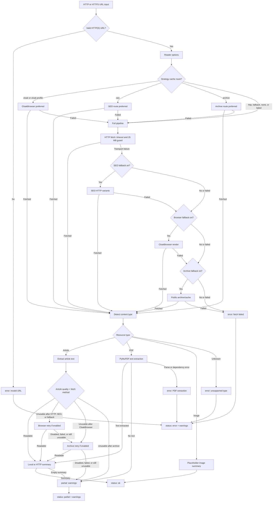
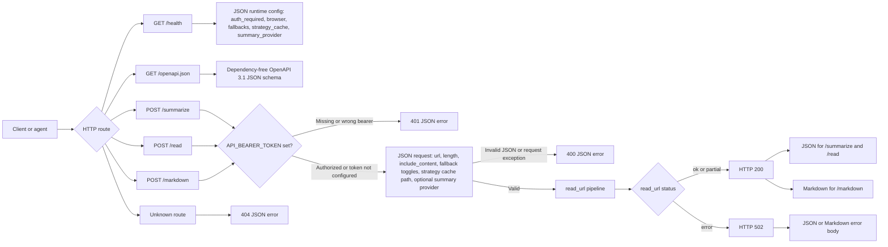

# Supersocks URL Scraper

[](pyproject.toml)
[](pyproject.toml)
[](LICENSE)
[](https://github.com/iamsupersocks/supersocks-url-scraper)

> **Turn a URL into usable context.**

Give the package an HTTP(S) URL and get back a small JSON or Markdown contract with the title, content type, readable summary, selected fetch route, and warnings when the read is partial.

🌐 [Repository](https://github.com/iamsupersocks/supersocks-url-scraper) · 🧩 JSON + Markdown · 🔒 Local-first by default · 📄 MIT

It starts dependency-light for normal pages, then can opt into article/PDF extraction, CloakBrowser rendering, public archive/cache lookups, a metadata-only routing strategy cache, and a tiny HTTP service. It is not a hosted bypass service and ships no credentials, browser profiles, vendor-specific LLM SDK, or universal paywall guarantee.

## Quick start

```bash
pip install 'supersocks-url-scraper[full]'

supersocks-url-scraper --include-content --length 1200 https://example.com/article

supersocks-url-scraper --serve --host 127.0.0.1 --port 8768
curl -s http://127.0.0.1:8768/summarize \
  -H 'content-type: application/json' \
  -d '{"url":"https://example.com/article","length":900}'
```

## Features

- No required third-party runtime dependencies for the basic reader.
- Optional extras for high-quality article extraction and PDF parsing.
- CLI one-shot mode.
- Optional HTTP service with `/health`, `/summarize`, `/read`, and `/markdown`.
- Detects articles, PDFs, images, and unknown binary content.
- Extracts from:
  - OpenGraph/Twitter/HTML metadata
  - JSON-LD article objects
  - trafilatura/readability/BeautifulSoup when optional article extras are installed
  - readable `<p>` paragraphs or regex fallback without extras
- PDF text extraction via optional PyMuPDF.
- Deterministic placeholder descriptions for images when no vision model is configured.
- SEO-style HTTP fallback variants: Googlebot, Bingbot, Google/Facebook/t.co referers.
- Optional browser/Cloak fallback for hostile media when the `browser` extra is installed.
- Layered fallback pipeline: HTTP → SEO variants → CloakBrowser → public archive/cache snapshots, including retry when HTTP returns only a teaser/paywall/cookie wall.
- Optional per-domain JSON strategy cache storing only routing metadata.
- Markdown output.
- Returns warnings for partial extraction, boilerplate, paywalls, and placeholders.
- Safe to run locally or in cron/server contexts.

## Architecture diagrams

### URL read pipeline



### HTTP service contract



## Limitations

The basic scraper intentionally starts without a browser. With `browser_fallback` disabled or without the `browser` extra installed, it may return partial or boilerplate content for:

- JavaScript-heavy pages
- login walls
- cookie walls
- bot checks / CAPTCHA pages
- social sites that hide content from simple HTTP clients

When that happens, check the `status` and `warnings` fields.

## Install

```bash
pip install supersocks-url-scraper
```

For better article extraction and PDF support:

```bash
pip install 'supersocks-url-scraper[full]'
```

For hostile/paywalled media fallback via CloakBrowser:

```bash
pip install 'supersocks-url-scraper[full,browser]'
```

> **Important:** for the best paywall / anti-bot results, install the `browser` extra or use the default Docker image. Without CloakBrowser, the tool still works for normal sites but cannot perform the browser-rendered fallback that handles many 403s, bot walls, and paywall-heavy publishers.

Or from a local checkout:

```bash
python -m venv .venv
. .venv/bin/activate
pip install -e .
# or: pip install -e '.[full,test]'
```

## CLI usage

```bash
supersocks-url-scraper https://example.com/article
```

With longer summary:

```bash
supersocks-url-scraper --length 1500 https://example.com/article
```

Include cleaned page content:

```bash
supersocks-url-scraper --include-content https://example.com/article
```

Markdown output:

```bash
supersocks-url-scraper --markdown --include-content https://example.com/article
```

Use an optional metadata-only per-domain strategy cache:

```bash
supersocks-url-scraper --strategy-cache ./fetch-strategies.json https://example.com/article
```

Enable optional browser fallback for hostile media such as some Le Point / Les Échos pages. This is the recommended mode for paywall-heavy use:

```bash
supersocks-url-scraper \
  --browser-fallback \
  --browser-post-load-wait-ms 10000 \
  https://www.lesechos.fr/industrie-services/energie-environnement/emissions-de-co2-ou-en-est-la-france-secteur-par-secteur-2038411
```

In recent local tests, the full media panel reached 31/31 successful reads only when CloakBrowser was available. Without the `browser` extra, normal HTTP/SEO/archive routes still work, but browser-only cases such as some Les Échos, Le Point, WSJ, Bloomberg, Libération, and Washington Post URLs can fail or become much slower.

By default the CLI also tries public archive/cache snapshots as a last resort, including when a publisher returns HTTP 200 but extraction detects only a subscriber teaser/cookie wall. Disable that with:

```bash
supersocks-url-scraper --no-archive-fallback https://example.com/article
```

For sites that need an already-authenticated/sessioned browser profile, pass a persistent profile directory:

```bash
supersocks-url-scraper \
  --browser-fallback \
  --browser-profile-dir ./browser-profile \
  https://www.lepoint.fr/environnement/les-effets-concrets-du-rechauffement-des-oceans-sur-la-peche-13-12-2025-2605287_1927.php
```

The strategy cache may also seed browser routes with `{"fetch_method":"cloak"}` or `{"fetch_method":"cloak-profile"}` for a domain. The cache stores routing metadata only — no cookies, tokens, page content, or profile data.

A generic media strategy seed is included for tested domains. It currently contains verified routes for 20+ common media domains, so repeat runs can jump directly to `http`, `seo`, or `cloak` where appropriate:

```bash
python3 scripts/seed_strategy_cache.py \
  --seed examples/fetch-strategies.media.seed.json \
  --cache data/fetch-strategies.json

supersocks-url-scraper \
  --strategy-cache data/fetch-strategies.json \
  --browser-fallback \
  --browser-profile-dir ./browser-profile \
  https://www.lepoint.fr/...
```

To discover/update routes from your own representative URLs without storing any page content:

```bash
python3 scripts/discover_strategy.py \
  --cache data/fetch-strategies.json \
  --browser-fallback 1 \
  --browser-profile-dir ./browser-profile \
  https://www.lesechos.fr/...
```

The discovery helper writes only metadata like `{"fetch_method":"cloak-profile","success_count":1}` keyed by normalized domain.

## Structured RTX price example

For a dynamic search page that embeds listing records in JSON, see
[`docs/GENERIC_RTX_PRICE_EXAMPLE.md`](docs/GENERIC_RTX_PRICE_EXAMPLE.md) and
[`examples/generic_rtx_prices.py`](examples/generic_rtx_prices.py). The example
keeps the target URL and field mapping local, uses the existing HTTP/SEO/browser
fetch primitives, filters RTX listings, converts EUR values, deduplicates by
listing id, and reports `ok`/`partial`/`error` with page-level warnings. It does
not store live HTML or provide a bypass flow.

An aggregate model-level snapshot is available in
[`docs/RTX_PRICE_ANALYSIS_REPORT.md`](docs/RTX_PRICE_ANALYSIS_REPORT.md). It
contains only counts and medians; live listing data and target details remain
outside the repository.

## HTTP service

Start the service:

```bash
supersocks-url-scraper --serve --host 127.0.0.1 --port 8768
```

For production-grade posture, configure safe defaults through environment variables and let callers use the same `/summarize` contract:

```bash
API_BEARER_TOKEN='***' \
BROWSER_FALLBACK=cloak \
BROWSER_PROFILE_DIR=/browser-profiles/default \
BROWSER_POST_LOAD_WAIT_MS=10000 \
BROWSER_MAX_CONCURRENCY=1 \
ARCHIVE_FALLBACK=latest \
FETCH_STRATEGY_CACHE_PATH=/data/fetch-strategies.json \
supersocks-url-scraper --serve --host 127.0.0.1 --port 8768
```

Supported service environment variables:

- `API_BEARER_TOKEN`: optional bearer token for `POST /summarize`, `/read`, and `/markdown`.
- `DEFAULT_SUMMARY_LENGTH`: default `length` when the request omits it.
- `BROWSER_FALLBACK`: set to `cloak`/`1`/`true` to enable browser fallback by default.
- `BROWSER_PROFILE_DIR`: persistent Cloak/Chromium profile directory, useful for sites requiring a warmed/sessioned browser profile.
- `BROWSER_POST_LOAD_WAIT_MS`: extra wait after DOMContentLoaded for consent/antibot scripts.
- `BROWSER_MAX_CONCURRENCY`: maximum concurrent CloakBrowser renders in this process. Keep this low; browser rendering is CPU/RAM-heavy.
- `ARCHIVE_FALLBACK`: set to `latest`/`1`/`true` to allow public archive/cache fallback by default.
- `SEO_FALLBACK`: enable/disable SEO-style HTTP variants by default.
- `FETCH_STRATEGY_CACHE_PATH`: metadata-only domain strategy cache.
- `SUMMARY_PROVIDER`: optional summary provider, default `local`. Currently supports `local`/`extractive`/`none` and `http`.
- `SUMMARY_PROVIDER_URL`: endpoint for `SUMMARY_PROVIDER=http`; unset by default.
- `SUMMARY_PROVIDER_TOKEN`: optional bearer token for the caller's own provider; unset by default.
- `SUMMARY_PROVIDER_TIMEOUT`: timeout in seconds for the optional provider.

Per-request JSON fields still override the environment defaults.

External summary providers are intentionally opt-in. The package ships no API keys and no vendor SDK dependency; the generic HTTP adapter posts `{url,title,content_type,length,content}` to your configured endpoint and accepts JSON `{summary: "..."}` or a plain-text response. If the provider fails, the reader falls back to the local extractive summarizer and includes a warning.


Health check:

```bash
curl http://127.0.0.1:8768/health
```

The health payload includes service config metadata: whether auth is required, whether the browser extra is installed, browser fallback defaults, profile/cache path status, archive/SEO defaults, and the configured browser concurrency limit. `GET /openapi.json` exposes a dependency-free OpenAPI 3.1 schema for the public HTTP contract.

Docker Compose production-style local deployment:

```bash
cp .env.example .env
# edit .env and set API_BEARER_TOKEN to a random local value
docker compose up -d --build
curl http://127.0.0.1:8768/health
```

The included `docker-compose.yml` binds the service to localhost, mounts `./data` and `./browser-profiles`, enables browser/archive fallback by default, and runs a `/health` healthcheck. For the full public deployment recipe, see [`docs/PUBLIC_DEPLOYMENT.md`](docs/PUBLIC_DEPLOYMENT.md).

Summarize a URL:

```bash
curl -s http://127.0.0.1:8768/summarize \
  -H 'content-type: application/json' \
  -d '{"url":"https://example.com/article","length":900}' | jq
```

Browser fallback can also be enabled per request:

```bash
curl -s http://127.0.0.1:8768/summarize \
  -H 'content-type: application/json' \
  -d '{"url":"https://www.lepoint.fr/...","length":1200,"include_content":true,"browser_fallback":true,"archive_fallback":true,"browser_post_load_wait_ms":10000}' | jq
```

`/read` is an alias that returns the same JSON contract. `/markdown` returns `text/markdown`:

```bash
curl -s http://127.0.0.1:8768/markdown \
  -H 'content-type: application/json' \
  -d '{"url":"https://example.com/article","length":900,"include_content":true}'
```

Response shape:

```json
{
  "status": "ok",
  "url": "https://example.com/article",
  "content_type": "article",
  "title": "Article title",
  "summary": "Readable summary text...",
  "length": 900,
  "fetch_method": "http",
  "warnings": [],
  "image_url": "https://example.com/og.jpg"
}
```

## Python usage

```python
from supersocks_url_scraper import read_url

result = read_url("https://example.com/article", length=1200)
print(result["title"])
print(result["summary"])
```

## Docker

```bash
docker build -t supersocks-url-scraper .
docker run --rm -p 8768:8768 supersocks-url-scraper
```

The default Docker image installs `full,browser`, Chromium runtime libraries, and prewarms the CloakBrowser binary so browser fallback works inside the container. For a smaller no-browser image:

```bash
docker build --build-arg INSTALL_EXTRAS=full --build-arg PREWARM_BROWSER=0 -t supersocks-url-scraper:lite .
```

## Architecture coverage

This public repo includes a standalone URL-reading core suitable for agent/news pipelines. See `docs/PUBLIC_READER_PARITY.md` for the public compatibility boundary and roadmap.


- HTTP fetching with timeout and size guards.
- Article/PDF/image detection.
- Article extraction with metadata, JSON-LD, trafilatura, readability, BeautifulSoup, and regex fallback.
- Local extractive summaries plus optional full cleaned content.
- Optional generic HTTP summary-provider adapter for external summaries; disabled by default and no private keys shipped.
- SEO-style requests: Googlebot, Bingbot, and search/social referer variants.
- Optional CloakBrowser rendering, including persistent browser profiles. This is critical for the strongest paywall/anti-bot coverage.
- Public archive/cache fallbacks: Google cache URL pattern, archive.today, archive.is, and Wayback.
- Quality gates that reject cookie walls, subscriber teasers, CAPTCHA/domain-only stubs, JS-only pages, and short error pages before summarizing.
- Per-domain strategy cache plus a generic media seed.
- Public regression corpus covering normal HTML, hostile media, PDFs, images, social-native stubs, JS-heavy surfaces, browser/profile routes, and archive fallback.
- Source-discovery registry and route-discovery scripts that persist only domain/routing metadata.
- Browser-profile probe for warming or inspecting operator-owned Cloak profiles without committing sessions.
- Docker image with browser runtime.

Intentionally excluded from this standalone public repo: social-network-native routes, private automation, chat integrations, hosted-service authentication, provider credentials/vendor-specific LLM SDK wiring, and vision-provider wiring. Those are application integrations, not required for the URL/paywall-reading core.

## Educational use, responsibility, and privacy

This project is provided for educational and research purposes. It demonstrates common URL reading, readability extraction, browser rendering, SEO-style requests, and public archive/cache lookup techniques. These techniques are often used to access or bypass soft paywalls, bot walls, and content exposed to browsers, crawlers, caches, or public archives. No tool can guarantee access to every paywall, especially account-only or server-side hard paywalls. You are responsible for complying with applicable laws, website terms, copyright rules, rate limits, and account/subscription agreements. Use at your own risk.

This repository is standalone and does not include:

- tokens or credentials
- browser profiles or cookies

## License

MIT
