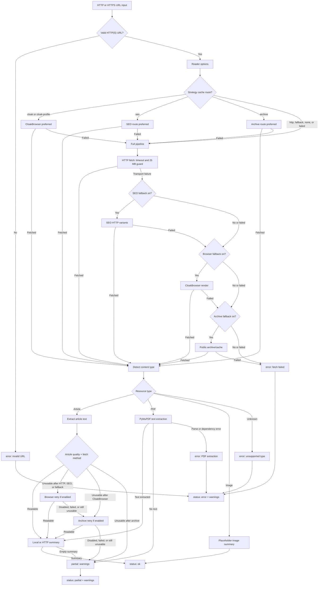
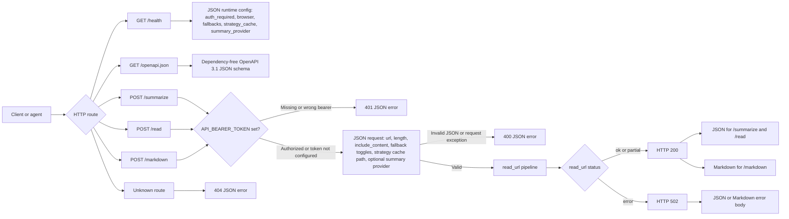

# Supersocks URL Scraper

[](pyproject.toml)
[](pyproject.toml)
[](LICENSE)
[](https://github.com/iamsupersocks/supersocks-url-scraper)

> **Turn a URL into usable context.**

Give the package an HTTP(S) URL and get back a small JSON or Markdown contract with the title, content type, readable summary, selected fetch route, and warnings when the read is partial.

🌐 [Repository](https://github.com/iamsupersocks/supersocks-url-scraper) · 🧩 JSON + Markdown · 🔒 Local-first by default · 📄 MIT

It starts dependency-light for normal pages, then can opt into article/PDF extraction, CloakBrowser rendering, public archive/cache lookups, a metadata-only routing strategy cache, and a tiny HTTP service. It is not a hosted bypass service and ships no credentials, browser profiles, vendor-specific LLM SDK, or universal paywall guarantee.

## Quick start

**Publication status:** PyPI and the npm registry do not host `supersocks-url-scraper@0.2.0` yet (both return 404). Until registry publishes happen, install from a GitHub checkout, pipx, or a packed npm tarball — not from `pip install` / `npx` against the public registries.

Python (from GitHub with pipx today):

```bash
pipx install 'git+https://github.com/iamsupersocks/supersocks-url-scraper.git'

supersocks-url-scraper --include-content --length 1200 https://example.com/article
```

Optional Python extras (`full`, `browser`, `youtube`, …) are not bundled by default; install them explicitly into the pipx/venv environment when needed (see [Install](#install)).

npm launcher (install from this checkout today; registry publish is future):

```bash
# Future (after npm publish):
# npx supersocks-url-scraper https://example.com/article
# npm install -g supersocks-url-scraper

# Today, from this repository:
npm pack
npm install -g ./supersocks-url-scraper-0.2.0.tgz
supersocks-url-scraper https://example.com/article
```

The npm launcher bootstraps the **base** Python engine offline from the embedded package. Optional extras for article/PDF extraction, CloakBrowser, and YouTube are **not** auto-installed; add them explicitly to the versioned cache venv if needed (see [Install](#install)).

Optional HTTP service:

```bash
supersocks-url-scraper --serve --host 127.0.0.1 --port 8768
curl -s http://127.0.0.1:8768/summarize \
  -H 'content-type: application/json' \
  -d '{"url":"https://example.com/article","length":900}'
```

## Features

- No required third-party runtime dependencies for the basic reader.
- Optional extras for high-quality article extraction and PDF parsing.
- Optional `youtube`/`social` extras for public YouTube metadata and subtitle extraction via yt-dlp (no media download; never auto-installed).
- CLI one-shot mode.
- Optional HTTP service with `/health`, `/summarize`, `/read`, and `/markdown`.
- Detects articles, PDFs, images, and unknown binary content.
- Extensible public social routing for YouTube and LinkedIn (specialized public LinkedIn guest extraction first; generic pipeline and opt-in Jina Reader only as last resorts).
- Extracts from:
  - OpenGraph/Twitter/HTML metadata
  - JSON-LD article objects
  - trafilatura/readability/BeautifulSoup when optional article extras are installed
  - readable `<p>` paragraphs or regex fallback without extras
- PDF text extraction via optional PyMuPDF.
- Deterministic placeholder descriptions for images when no vision model is configured.
- SEO-style HTTP fallback variants: Googlebot, Bingbot, Google/Facebook/t.co referers.
- Optional browser/Cloak fallback for hostile media when the `browser` extra is installed.
- Recognized consent dialogs are dismissed through an explicit reject/continue-without-accepting control before browser extraction.
- Layered fallback pipeline: HTTP → SEO variants → CloakBrowser → public archive/cache snapshots, including retry when HTTP returns only a teaser/paywall/cookie wall.
- Optional per-domain JSON strategy cache storing only routing metadata.
- Markdown output.
- Returns warnings for partial extraction, boilerplate, paywalls, and placeholders.
- Safe to run locally or in cron/server contexts.

## Architecture diagrams

### URL read pipeline



### HTTP service contract



## Limitations

The basic scraper intentionally starts without a browser. With `browser_fallback` disabled or without the `browser` extra installed, it may return partial or boilerplate content for:

- JavaScript-heavy pages
- login walls
- cookie walls
- bot checks / CAPTCHA pages
- social sites that hide content from simple HTTP clients

When that happens, check the `status` and `warnings` fields.

## Install

### Python (pip / pipx)

**PyPI:** not published yet — `pip install supersocks-url-scraper` returns 404 until a release is uploaded.

From GitHub with pipx (recommended today):

```bash
pipx install 'git+https://github.com/iamsupersocks/supersocks-url-scraper.git'
# Optional extras require explicit install, e.g. after pipx install:
# pipx inject supersocks-url-scraper 'PyMuPDF>=1.24' 'trafilatura>=1.12' ...
```

Or from a local checkout:

```bash
python -m venv .venv
. .venv/bin/activate
pip install -e .
# Optional extras on a checkout:
# pip install -e '.[full,test]'
# pip install -e '.[full,browser]'
# pip install -e '.[youtube]'
```

Future (after PyPI publish):

```bash
# pip install supersocks-url-scraper
# pip install 'supersocks-url-scraper[full]'
# pip install 'supersocks-url-scraper[full,browser]'
# pip install 'supersocks-url-scraper[youtube]'
# pip install 'supersocks-url-scraper[social]'
```

> **Important:** for the best paywall / anti-bot results, install the `browser` extra or use the default Docker image. Without CloakBrowser, the tool still works for normal sites but cannot perform the browser-rendered fallback that handles many 403s, bot walls, and paywall-heavy publishers.

### npm (Node launcher, version 0.2.0)

The repository ships a zero-dependency Node bin that bootstraps an isolated Python >=3.10 venv under `XDG_CACHE_HOME/supersocks-url-scraper` (or `~/.cache/supersocks-url-scraper`) from the **embedded** Python package inside the npm tarball. No `postinstall`, no remote GitHub/curl install, and no sudo.

**Publication status:** `package.json` is prepared for the npm name `supersocks-url-scraper@0.2.0`, but **`npm publish` has not been executed**. Until a registry publish happens, install from a packed tarball or path — do not expect `npx supersocks-url-scraper` to resolve from the public registry yet.

```bash
# Future (after npm publish):
# npx supersocks-url-scraper https://example.com/article
# npm install -g supersocks-url-scraper

# Today, from this checkout:
npm pack
npm install -g ./supersocks-url-scraper-0.2.0.tgz
# or one-shot without a global install:
npx --yes ./supersocks-url-scraper-0.2.0.tgz https://example.com/article
```

Requirements for the launcher: Node >=18 and Python >=3.10 on `PATH` (or set `PYTHON=`). Optional Python extras (`full`, `browser`, `youtube`, …) are not auto-installed by the npm launcher; install them into the versioned cache venv manually if needed.

## CLI usage

```bash
supersocks-url-scraper https://example.com/article
```

With longer summary:

```bash
supersocks-url-scraper --length 1500 https://example.com/article
```

Include cleaned page content:

```bash
supersocks-url-scraper --include-content https://example.com/article
```

Markdown output:

```bash
supersocks-url-scraper --markdown --include-content https://example.com/article
```

Use an optional metadata-only per-domain strategy cache:

```bash
supersocks-url-scraper --strategy-cache ./fetch-strategies.json https://example.com/article
```

Enable optional browser fallback for hostile media, JavaScript-heavy pages, consent walls, bot checks, and soft paywalls. This is the recommended mode for paywall-heavy use:

```bash
supersocks-url-scraper \
  --browser-fallback \
  --browser-post-load-wait-ms 10000 \
  https://js-heavy-publisher.example/articles/rendered-story
```

Agent guidance: start with the normal route. If the result is `error` or
`partial` and its warnings mention a 403, JavaScript, or a consent wall, retry
with `browser_fallback=true`. The browser route only dismisses recognized
consent dialogs through an explicit reject or continue-without-accepting
control. If the result remains `partial`, route the URL elsewhere instead of
asking the agent to click arbitrary page controls.

Without the `browser` extra, normal HTTP/SEO/archive routes still work, but browser-only publisher categories can fail, return only boilerplate/teasers, or become much slower.

By default the CLI also tries public archive/cache snapshots as a last resort, including when a publisher returns HTTP 200 but extraction detects only a subscriber teaser/cookie wall. Disable that with:

```bash
supersocks-url-scraper --no-archive-fallback https://example.com/article
```

### Public social routing (YouTube / LinkedIn)

Social routing is inspired by the channel/backend pattern popularized by [Agent Reach](https://github.com/Panniantong/Agent-Reach) (MIT). This repository adapts that idea minimally for two public platforms and does **not** vendor Agent Reach, copy its package, auto-install upstream tools, or enable authenticated LinkedIn/MCP/browser-login flows.

- **YouTube** (`youtube.com`, `youtu.be`): when the optional `youtube`/`social` extra is installed, metadata and available subtitles/auto-captions are extracted with `yt-dlp` (`fetch_method=yt-dlp`, `platform=youtube`) without downloading media. If yt-dlp is missing, the reader warns and falls back to the generic HTTP pipeline.
- **LinkedIn** (`linkedin.com`): uses a specialized **public guest** extractor first. It classifies common public paths (`/in/`, `/company/`, `/school/`, `/showcase/`, `/jobs/view/` and jobs-guest variants, `/pulse/`/`/articles/`, `/posts/`/`/feed/update/`), prefers Open Graph/meta, valid JSON-LD, and stable guest selectors, and may add backward-compatible fields `linkedin_page_type` and `structured_data`. Auth walls, security challenges, navigation/CTA shells, and too-poor useful content return `status=partial` with an explicit warning — never `ok`. The generic HTTP/SEO/Cloak/archive pipeline and the opt-in Jina Reader fallback run only as last resorts. Jina is off by default and blocked for credentialed URLs, localhost/private hosts, and non-HTTP(S) schemes. No cookies, tokens, Voyager private APIs, login browsers, proxies, or caller headers are used or forwarded. Successful Jina reads set `fetch_method=jina` and warn `external reader used: jina`.

```bash
# YouTube (requires optional yt-dlp extra)
supersocks-url-scraper --include-content https://www.youtube.com/watch?v=EXAMPLEVIDEO01

# LinkedIn specialized public extraction; optional Jina only when explicitly requested
supersocks-url-scraper --jina-fallback https://www.linkedin.com/pulse/example-public-post
```

**LinkedIn public support and limits:** guest-visible HTML/meta/JSON-LD only. Logged-in-only content, paywalled profiles, and challenge pages are reported as `partial` rather than guessed. Authenticated LinkedIn scraping remains out of scope.

Domain matching rejects suffix lookalikes (e.g. `notyoutube.com`) and URLs with userinfo/credentials.

For sites that need an already-authenticated/sessioned browser profile, pass a persistent profile directory:

```bash
supersocks-url-scraper \
  --browser-fallback \
  --browser-profile-dir ./browser-profile \
  https://consent-paywall-publisher.example/articles/profile-backed-story
```

The strategy cache may also seed browser routes with `{"fetch_method":"cloak"}` or `{"fetch_method":"cloak-profile"}` for a domain. The cache stores routing metadata only — no cookies, tokens, page content, or profile data.

The shipped media strategy seed is a compact structural template, not a list of tested publishers. It uses only reserved `.example` domains to show useful route categories (`http`, `seo`, `cloak`, `cloak-profile`, `archive`, PDF, and image handling):

```bash
python3 scripts/seed_strategy_cache.py \
  --seed examples/fetch-strategies.media.seed.json \
  --cache data/fetch-strategies.json

supersocks-url-scraper \
  --strategy-cache data/fetch-strategies.json \
  --browser-fallback \
  --browser-profile-dir ./browser-profile \
  https://ordinary-publisher.example/articles/ordinary-html
```

### Feeding your own representative URL list

Operators should keep real representative URLs local and private:

1. Create `data/representative-urls.txt`, one URL per line.
2. Run metadata-only route discovery:

```bash
mkdir -p data
python3 scripts/discover_strategy.py \
  --urls-file data/representative-urls.txt \
  --cache data/fetch-strategies.json \
  --browser-fallback 1 \
  --browser-profile-dir ./browser-profile
```

3. Review the metadata-only results and `data/fetch-strategies.json`.
4. Optionally merge an operator-owned private seed:

```bash
python3 scripts/seed_strategy_cache.py \
  --seed data/private-fetch-strategies.seed.json \
  --cache data/fetch-strategies.json \
  --overwrite
```

`data/` is gitignored. Never commit real URLs, domains, cookies, fetched content, raw HTML, browser profiles, screenshots, tokens, or local private seeds. The discovery helper writes only metadata like `{"fetch_method":"cloak-profile","success_count":1}` keyed by normalized domain.

## Structured RTX price example

For a dynamic search page that embeds listing records in JSON, see
[`docs/GENERIC_RTX_PRICE_EXAMPLE.md`](docs/GENERIC_RTX_PRICE_EXAMPLE.md) and
[`examples/generic_rtx_prices.py`](examples/generic_rtx_prices.py). The example
keeps the target URL and field mapping local, uses the existing HTTP/SEO/browser
fetch primitives, filters RTX listings, converts EUR values, deduplicates by
listing id, and reports `ok`/`partial`/`error` with page-level warnings. It does
not store live HTML or provide a bypass flow.

An aggregate model-level snapshot is available in
[`docs/RTX_PRICE_ANALYSIS_REPORT.md`](docs/RTX_PRICE_ANALYSIS_REPORT.md). It
contains only counts and medians; live listing data and target details remain
outside the repository.

## HTTP service

Start the service:

```bash
supersocks-url-scraper --serve --host 127.0.0.1 --port 8768
```

For production-grade posture, configure safe defaults through environment variables and let callers use the same `/summarize` contract:

```bash
API_BEARER_TOKEN='***' \
BROWSER_FALLBACK=cloak \
BROWSER_PROFILE_DIR=/browser-profiles/default \
BROWSER_POST_LOAD_WAIT_MS=10000 \
BROWSER_MAX_CONCURRENCY=1 \
ARCHIVE_FALLBACK=latest \
FETCH_STRATEGY_CACHE_PATH=/data/fetch-strategies.json \
supersocks-url-scraper --serve --host 127.0.0.1 --port 8768
```

Supported service environment variables:

- `API_BEARER_TOKEN`: optional bearer token for `POST /summarize`, `/read`, and `/markdown`.
- `DEFAULT_SUMMARY_LENGTH`: default `length` when the request omits it.
- `BROWSER_FALLBACK`: set to `cloak`/`1`/`true` to enable browser fallback by default.
- `BROWSER_PROFILE_DIR`: persistent Cloak/Chromium profile directory, useful for sites requiring a warmed/sessioned browser profile.
- `BROWSER_POST_LOAD_WAIT_MS`: extra wait after DOMContentLoaded for consent/antibot scripts.
- `BROWSER_MAX_CONCURRENCY`: maximum concurrent CloakBrowser renders in this process. Keep this low; browser rendering is CPU/RAM-heavy.
- `ARCHIVE_FALLBACK`: set to `latest`/`1`/`true` to allow public archive/cache fallback by default.
- `SEO_FALLBACK`: enable/disable SEO-style HTTP variants by default.
- `JINA_FALLBACK`: opt-in Jina Reader fallback after specialized LinkedIn (or generic last-resort) `error`/`partial` results. Disabled by default. Never used for credentialed, local, or private URLs; never forwards cookies/tokens.
- `FETCH_STRATEGY_CACHE_PATH`: metadata-only domain strategy cache.
- `SUMMARY_PROVIDER`: optional summary provider, default `local`. Supports `local`/`extractive`/`none`, generic `http`, and opt-in `kimi`.
- `SUMMARY_PROVIDER_URL`: endpoint for `SUMMARY_PROVIDER=http`, or optional override of the Kimi chat-completions URL; unset by default.
- `SUMMARY_PROVIDER_TOKEN`: optional bearer token for the caller's own `http` provider, or Kimi API key override; unset by default. Never logged.
- `SUMMARY_PROVIDER_TIMEOUT`: timeout in seconds for the optional provider.
- `KIMI_API_KEY`: Moonshot/Kimi API key used only when `SUMMARY_PROVIDER=kimi` (or per-request `summary_provider=kimi`). Never logged or shipped.
- `KIMI_API_URL`: OpenAI-compatible chat completions URL for Kimi; default `https://api.moonshot.ai/v1/chat/completions`.
- `KIMI_MODEL`: Kimi model id; default `kimi-k2.5`.

Per-request JSON fields still override the environment defaults.

External summary providers are intentionally opt-in. The package ships no API keys and no vendor SDK dependency. The generic HTTP adapter posts `{url,title,content_type,length,content}` to your configured endpoint and accepts JSON `{summary: "..."}` or a plain-text response. The Kimi adapter is a direct OpenAI-compatible `POST` used only when `provider=kimi`; it summarizes already-extracted text and does **not** scrape the page. Warning: enabling Kimi sends extracted page text to a third-party API (cost + confidentiality). If any provider fails, the reader falls back to the local extractive summarizer and includes a warning.

Exact Kimi opt-in example (CLI):

```bash
export KIMI_API_KEY=YOUR_MOONSHOT_KEY
supersocks-url-scraper 'https://example.com/article' \
  --summary-provider kimi \
  --length 600
```

Exact Kimi opt-in example (HTTP service):

```bash
export SUMMARY_PROVIDER=kimi
export KIMI_API_KEY=YOUR_MOONSHOT_KEY
# optional overrides:
# export KIMI_API_URL=https://api.moonshot.ai/v1/chat/completions
# export KIMI_MODEL=kimi-k2.5
supersocks-url-scraper --serve --host 127.0.0.1 --port 8768

curl -s http://127.0.0.1:8768/summarize \
  -H 'content-type: application/json' \
  -d '{"url":"https://example.com/article","length":600,"summary_provider":"kimi"}' | jq
```

Leave `SUMMARY_PROVIDER=local` (the default) for offline/local-only operation with no third-party summary calls.


Health check:

```bash
curl http://127.0.0.1:8768/health
```

The health payload includes service config metadata: whether auth is required, whether the browser extra is installed, browser fallback defaults, profile/cache path status, archive/SEO defaults, the configured browser concurrency limit, and under `social` whether yt-dlp is installed plus a boolean `js_runtime_available` (true when `node` or `deno` is on `PATH`; informational only, never installed or required). `GET /openapi.json` exposes a dependency-free OpenAPI 3.1 schema for the public HTTP contract.

Docker Compose production-style local deployment:

```bash
cp .env.example .env
# edit .env and set API_BEARER_TOKEN to a random local value
docker compose up -d --build
curl http://127.0.0.1:8768/health
```

The included `docker-compose.yml` binds the service to localhost, mounts `./data` and `./browser-profiles`, enables browser/archive fallback by default, and runs a `/health` healthcheck. For the full public deployment recipe, see [`docs/PUBLIC_DEPLOYMENT.md`](docs/PUBLIC_DEPLOYMENT.md).

Summarize a URL:

```bash
curl -s http://127.0.0.1:8768/summarize \
  -H 'content-type: application/json' \
  -d '{"url":"https://example.com/article","length":900}' | jq
```

Browser fallback can also be enabled per request:

```bash
curl -s http://127.0.0.1:8768/summarize \
  -H 'content-type: application/json' \
  -d '{"url":"https://consent-paywall-publisher.example/articles/profile-backed-story","length":1200,"include_content":true,"browser_fallback":true,"archive_fallback":true,"browser_post_load_wait_ms":10000}' | jq
```

`/read` is an alias that returns the same JSON contract. `/markdown` returns `text/markdown`:

```bash
curl -s http://127.0.0.1:8768/markdown \
  -H 'content-type: application/json' \
  -d '{"url":"https://example.com/article","length":900,"include_content":true}'
```

Response shape:

```json
{
  "status": "ok",
  "url": "https://example.com/article",
  "content_type": "article",
  "title": "Article title",
  "summary": "Readable summary text...",
  "length": 900,
  "fetch_method": "http",
  "warnings": [],
  "image_url": "https://example.com/og.jpg"
}
```

Optional social fields may also appear when routing matches: `platform`, `author`, `published_at`, `duration`, `transcript`, `transcript_source`. Existing fields remain stable.
## Python usage

```python
from supersocks_url_scraper import read_url

result = read_url("https://example.com/article", length=1200)
print(result["title"])
print(result["summary"])
```

## Docker

```bash
docker build -t supersocks-url-scraper .
docker run --rm -p 8768:8768 supersocks-url-scraper
```

The default Docker image installs `full,browser`, Chromium runtime libraries, and prewarms the CloakBrowser binary so browser fallback works inside the container. For a smaller no-browser image:

```bash
docker build --build-arg INSTALL_EXTRAS=full --build-arg PREWARM_BROWSER=0 -t supersocks-url-scraper:lite .
```

## Architecture coverage

This public repo includes a standalone URL-reading core suitable for agent/news pipelines. See `docs/PUBLIC_READER_PARITY.md` for the public compatibility boundary and roadmap.


- HTTP fetching with timeout and size guards.
- Article/PDF/image detection.
- Article extraction with metadata, JSON-LD, trafilatura, readability, BeautifulSoup, and regex fallback.
- Local extractive summaries plus optional full cleaned content.
- Optional generic HTTP summary-provider adapter for external summaries; disabled by default and no private keys shipped.
- Optional opt-in Kimi/Moonshot OpenAI-compatible summarizer (`provider=kimi`) that summarizes extracted text only; never called unless explicitly selected; falls back to local extractive summary on failure.
- SEO-style requests: Googlebot, Bingbot, and search/social referer variants.
- Optional CloakBrowser rendering, including persistent browser profiles. This is critical for the strongest paywall/anti-bot coverage.
- Public archive/cache fallbacks: Google cache URL pattern, archive.today, archive.is, and Wayback.
- Quality gates that reject cookie walls, subscriber teasers, CAPTCHA/domain-only stubs, JS-only pages, and short error pages before summarizing.
- Per-domain strategy cache plus a generic media seed.
- Public regression corpus covering normal HTML, hostile media, PDFs, images, social-native stubs, JS-heavy surfaces, browser/profile routes, and archive fallback.
- Source-discovery registry and route-discovery scripts that persist only domain/routing metadata.
- Browser-profile probe for warming or inspecting operator-owned Cloak profiles without committing sessions.
- Docker image with browser runtime.

Public social routing included here is intentionally narrow and legal/privacy-preserving: YouTube metadata/subtitles via optional yt-dlp, and LinkedIn public guest pages via a specialized extractor (meta/JSON-LD/public selectors) with generic + opt-in Jina Reader only as last resorts. Architectural inspiration comes from Agent Reach (MIT) without importing or copying that project. Authenticated social scrapers, LinkedIn MCP, cookie/login browsers, Voyager private APIs, and private indexers remain excluded.

Intentionally excluded from this standalone public repo: authenticated social-network scrapers, private automation, chat integrations, hosted-service authentication, provider credentials/vendor-specific LLM SDK wiring, and vision-provider wiring. Those are application integrations, not required for the URL/paywall-reading core.

## Educational use, responsibility, and privacy

This project is provided for educational and research purposes. It demonstrates common URL reading, readability extraction, browser rendering, SEO-style requests, and public archive/cache lookup techniques. These techniques are often used to access or bypass soft paywalls, bot walls, and content exposed to browsers, crawlers, caches, or public archives. No tool can guarantee access to every paywall, especially account-only or server-side hard paywalls. You are responsible for complying with applicable laws, website terms, copyright rules, rate limits, and account/subscription agreements. Use at your own risk.

This repository is standalone and does not include:

- tokens or credentials
- browser profiles or cookies

## License

MIT
