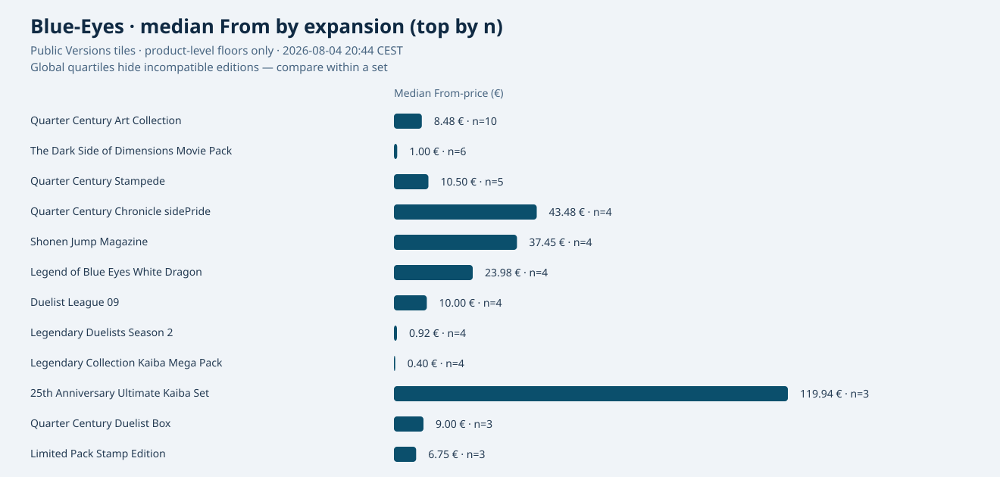
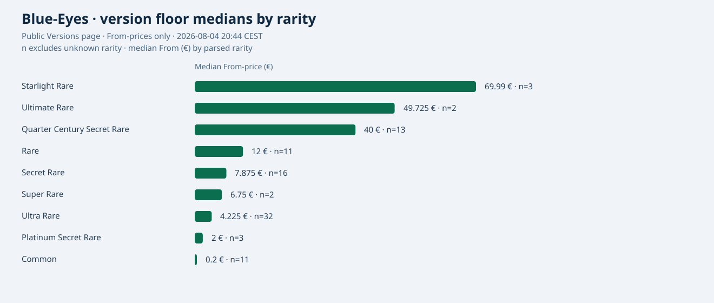
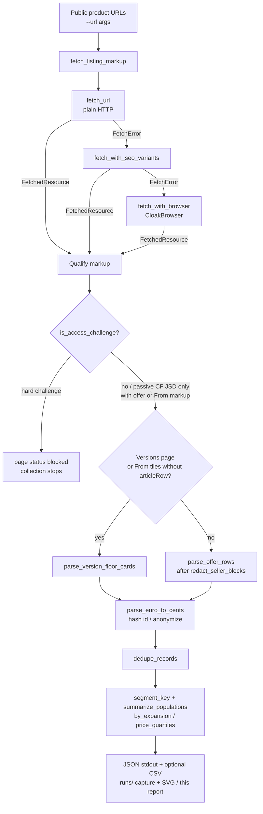

# Blue-Eyes White Dragon / Dragon Blanc analysis report

Public, bounded price snapshot for **Blue-Eyes White Dragon** /
**Dragon Blanc aux Yeux Bleus**, collected with
[`examples/blue_eyes_white_dragon_analysis.py`](../examples/blue_eyes_white_dragon_analysis.py)
and the same evidence posture as the RTX dossier: reproducible commands,
separated populations, no seller identities, no raw HTML in git.

**Sommaire.** Coverage **177/177** public product paths · **102** expansions ·
priced floors **175** (+ **2** `From N/A`) · live deep HTML **0/177** ·
official catalog join **177/177**. Edition-first tables and SVGs below; source
marketplace named only in [Source et provenance](#source-et-provenance).

Workflow docs:
[`BLUE_EYES_WHITE_DRAGON_SCRAPING_METHOD.md`](BLUE_EYES_WHITE_DRAGON_SCRAPING_METHOD.md).

> ### Verdict — premières éditions ≠ médiane des 177
>
> **Les médianes / planchers Cardmarket sur 175–177 impressions ne sont pas la
> cote d’une carte.** La médiane globale **~5 €** décrit seulement la dispersion
> de tuiles Versions incompatibles (commons de Structure Deck mélangés à des
> Ultra/Secret/promos). Elle **ne peut pas** être lue comme le prix d’une
> première édition.
>
> Les marchés historiques se lisent **par code imprimé + édition + langue +
> raw/gradé**, avec des preuves externes séparées des 177 métriques :
>
> | Landmark | Bande d’ordre de grandeur (preuves externes, USD sauf mention) |
> | --- | --- |
> | **LOB-001** (EN Amérique du Nord, 1st) | **milliers** raw ; **milliers → dizaines de milliers** en PSA 9 / PSA 10 |
> | **LOB-E001** (EN Europe, 1st) | **centaines** raw ; **milliers** en hauts grades |
> | **LDD-F001** (FR, print officiel Konami) | identité confirmée ; annonces FR = **asking**, pas ventes conclues |
>
> Registre sourcé/daté :
> [`docs/data/blue-eyes-white-dragon-external-comps-2026-08-05.json`](data/blue-eyes-white-dragon-external-comps-2026-08-05.json)
> · [`.md`](data/blue-eyes-white-dragon-external-comps-2026-08-05.md).
> Visuel d’ordre de grandeur :
> [`assets/blue-eyes-white-dragon-valuation-bands.svg`](assets/blue-eyes-white-dragon-valuation-bands.svg).

**Read this report edition-first.** Blue-Eyes / Dragon Blanc is not one SKU.
The useful unit is a public **version / product reference** (set label +
product path + optional Vn + rarity), not a global quartile across 175
incompatible tiles. Global aggregates are labeled **`NOT_A_CARD_PRICE`** in
code (`GLOBAL_AGGREGATE_POLICY` / `refuse_global_aggregate_as_card_price()`).

## What this analysis can and cannot say

**It can say**

- On a given public page, at a given time, these displayed EUR prices were
  parseable after browser rendering.
- Each Versions tile is one product-level **From** floor for one public product
  path; floors and live offers are different populations.
- Within one product URL, offers can be grouped by a five-field segment key
  (condition, language, rarity, edition, graded/raw).
- The pipeline is designed and offline-tested to stop on hard challenges; this
  live run detected none. It never logged in, solved CAPTCHA, or accepted
  tracking consent.

**It cannot say**

- “The” price of Blue-Eyes White Dragon as a single market number.
- The full marketplace inventory (only the first offer page per URL, ≤50 rows).
- That HTTP 200 was returned, or that the next run will succeed the same way.
- Official **printed** card numbers (`LOB-001`, `SDK-001`, …) — those codes are
  **not** present in the 175 `version_floor` records and are **never inferred**.
- Seller reputations, private listings, deleted ads, or graded-card markets
  (this sample had **0** graded offers).
- Behaviour of the canonical FR hub
  `https://www.cardmarket.com/fr/YuGiOh/Cards/BlueEyes-White-Dragon` — that URL
  was **not** fetched in this run.

## Y a-t-il vraiment toutes les références publiques ?

**Short answer:** for the public **Versions catalog** of Blue-Eyes White Dragon,
this coverage pass reached the site-announced counter (**177/177** unique public
product paths). That is **not** the same as “the full marketplace inventory”, “all offers”,
or “the official Konami historical print list”.

Distinguish three layers:

| Layer | What “complete” would mean | What this task observed |
| --- | --- | --- |
| **A. Public Versions / Search product paths** | Every public product path listed for this card on Versions (+ Search cross-check), up to a reproducible stop proof | **Yes for Versions:** announced **177 Versions**, **177** unique exact `Blue-Eyes-White-Dragon` paths after dedupe (includes **2** public `From N/A` tiles absent from the prior priced 175). Search `site=` pagination worked for pages **1–7**; pages **8+** hit hard challenges (stop after 3 consecutive). Search added **no** extra exact BEWD path beyond Versions after filtering related cards. |
| **B. Live offers / offer pagination** | Every seller row across every product and every offer page | **No.** Offer tables remain first-page only (≤50 rows) when fetched; product-detail pass aborted on hard challenges. |
| **C. Official historical catalog** | Every Konami print with collector number across all languages/regions | **No claim.** Printed codes were **not** exposed on Versions tiles; product-detail HTML did not yield collector numbers in the samples that rendered before challenges. Never invent `LOB-001`-style codes. |

Public artifacts for the coverage pass (see `completion_indicators` in the manifest):

- [`docs/data/blue-eyes-white-dragon-coverage-2026-08-04.csv`](data/blue-eyes-white-dragon-coverage-2026-08-04.csv) — sanitized paths + identity fields
- [`docs/data/blue-eyes-white-dragon-coverage-manifest-2026-08-04.json`](data/blue-eyes-white-dragon-coverage-manifest-2026-08-04.json) / [`.md`](data/blue-eyes-white-dragon-coverage-manifest-2026-08-04.md)

Proven scope (not “Versions + Search exhaustive”): public Versions panel **177/177**;
Search **site=1–7** only (hard challenges ×3); product details / printed codes **incomplete**.

Compared to the prior priced corpus (**175** paths / **102** expansions): overlap **175**,
**2** new public refs (`Duel-Royale-Deck-Set-EX` V1 Common + `Promos-OCG` bare),
**0** missing, still **102** expansions (both new paths sit in expansions already
present via other variants).

Stop proof recorded: Versions unique count reached the announced counter, then
**hard_challenges_x3** during Search tail / product-detail attempts. No login,
CAPTCHA solve, proxy rotation, or private API.

### Deep-enrichment follow-up (Search site=8+, product metrics)

A second, budget-capped deep pass (`--deep-enrichment`) seeds a deterministic
queue of the exact **177** coverage paths (White-Phantom-Beast excluded), with
atomic checkpoints (`pending` / `ok` / `challenge` / `error`) and no retry of
`ok` rows. Seeded `from_cents` / `available_count` cells are **reused from the
prior coverage CSV baseline**, not newly scraped in this window.

| Scope claim | Status after deep pass |
| --- | --- |
| **Versions complete** | **Yes** — inherited **177/177** from the coverage corpus; Versions pages were not re-fetched. |
| **Details enriched** | **No** — `details_enriched_partially=false` because live successes are **0/177** (zero is not “partial”). Search resume at `site=8` hit a hard challenge on first access; one bounded cooldown + second try still challenged → stop (`first_access_hard_challenge_after_cooldown`). **2** Search challenge navigations (counted separately from the product queue, which stayed at **0** challenge rows / **177** pending). Budget used: **2/40**. |
| **Offers exhaustive** | **No** — offer tables remain non-exhaustive (first page only when a detail page renders); language/condition aggregates are in-memory counts without seller rows. |

Published deep artifacts:

- [`docs/data/blue-eyes-white-dragon-deep-enrichment-2026-08-04.csv`](data/blue-eyes-white-dragon-deep-enrichment-2026-08-04.csv)
- [`docs/data/blue-eyes-white-dragon-deep-enrichment-manifest-2026-08-04.json`](data/blue-eyes-white-dragon-deep-enrichment-manifest-2026-08-04.json) / [`.md`](data/blue-eyes-white-dragon-deep-enrichment-manifest-2026-08-04.md)

Do **not** read the deep CSV `from_cents` / `available_count` columns (175 priced /
2 `From N/A`) as live deep-pass extractions — they are baseline coverage seeds on
still-`pending` rows.

### Official catalog join (products + price guide)

A third, non-HTML path joins the public official Yu-Gi-Oh downloads (exactly one
GET per URL when live; raw JSON stays **in memory only**):

- `https://downloads.s3.cardmarket.com/productCatalog/productList/products_singles_3.json`
- `https://downloads.s3.cardmarket.com/productCatalog/priceGuide/price_guide_3.json`

Live regeneration on **2026-08-04** (`fetched_live=true`): **86 255** singles →
strict name equality `Blue-Eyes White Dragon` → **177** products; **192**
`contains` matches of which **15** excluded (Malefic / Token / White Phantom
Beast); **177/177** price-guide joins by `idProduct`; **102** `idExpansion`;
single `idMetacard` **102062**. Decimals are preserved as provided (no float
coercion). SHA-256 digests in the manifest match the bytes actually fetched.

#### Cautious reading of official price fields

These guide metrics are **not interchangeable**:

| Field | How to read it |
| --- | --- |
| `low` | Current offer **floor** (plancher courant) at the price-guide snapshot — not a long-window average. |
| `avg` | Guide average for the product — distinct from the rolling windows below. |
| `trend` | Official guide trend indicator — **not** the same instrument as `avg` / `avg1` / `avg7` / `avg30`. |
| `avg1` / `avg7` / `avg30` | Rolling **temporal** averages (1 / 7 / 30 day windows). |

Foil columns (`*_foil`) are summarized only when present; `avg_foil` / `low_foil`
are empty on this snapshot, while `trend_foil` and the foil window averages are
partially populated.

Deterministic Decimal market statistics over the **177** rows (even-n median =
arithmetic mean of the two central Decimals as `(a + b) / 2`, serialized as
strings — never `float`) are published in the official manifest. Example
non-foil medians on this snapshot: `low` median **5**, `trend` median **14.07**,
`avg` median **13.61**. Top 5 by `trend` expose only `idProduct`, `idExpansion`,
and public price metrics — **no seller fields**.

#### Edition attribution limit

Official `productList` / `priceGuide` payloads expose `idExpansion` but **not**
expansion name, public product URL, rarity, or set code. Official prices
**cannot** be attributed to HTML edition/path slugs without a verified
URL↔`idProduct` mapping. The HTML coverage corpus (URL/path) and the official
corpus (`idProduct`) therefore stay as two concordant **177**-row populations;
the manifest does **not** invent rank-to-rank links.

Published official artifacts:

- [`docs/data/blue-eyes-white-dragon-official-join-2026-08-04.csv`](data/blue-eyes-white-dragon-official-join-2026-08-04.csv)
- [`docs/data/blue-eyes-white-dragon-official-join-manifest-2026-08-04.json`](data/blue-eyes-white-dragon-official-join-manifest-2026-08-04.json) / [`.md`](data/blue-eyes-white-dragon-official-join-manifest-2026-08-04.md)

Evidence posture unchanged: delay ≥ **8 s** + jitter for HTML deep pass, no
parallelism, no login / CAPTCHA / proxy / fingerprint spoof / private API.
Private ledger under gitignored `runs/` is sanitized on every atomic write.
Official raw catalogs, when cached offline, stay under gitignored `runs/` only.

## Why Blue-Eyes has no single price

Blue-Eyes White Dragon is many products at once: different expansions, rarities,
print versions (V1, V2, …), languages, conditions, and editions. A Structure
Deck common at **0.02 €** and a Duel Terminal Preview floor at **1999.99 €**
are both “Blue-Eyes” listings, but they are not comparable.

Cardmarket populations must stay separate from each other **and** from external
comps:

| Population | Where it comes from | What one row means |
| --- | --- | --- |
| `version_floor` | Versions overview tiles | Product-level **From** price for one version path — not a seller offer |
| `offer` | Product / card `article-row` blocks | One anonymized live listing on that page |
| `external_comps` | PSA / PriceCharting / Konami registry | Sourced landmark evidence — **not** merged into 177 metrics |

Averaging floors with offers, or merging offers across product URLs into one
median, silently invents a fake “Blue-Eyes price”. The example refuses that
merge in `summarize_populations()` and refuses treating global floor stats as a
card cote via `refuse_global_aggregate_as_card_price()`.

## Taxonomie de valorisation (segments)

Toute cote honnête nomme ces dimensions — pas une médiane globale :

| Dimension | Valeurs typiques | Où ça vit |
| --- | --- | --- |
| **Set / card code** | `LOB-001`, `LOB-E001`, `LDD-F001`, ou *absent* | Code imprimé officiel **ou** label d’expansion + path public (jamais inventé depuis `idProduct`) |
| **Édition** | `first_edition` / `unlimited` / `limited` / `reprint_unknown_edition` / `unknown` | Offers (tooltip) ; **absent** des tuiles Versions |
| **Langue / région** | `en-NA`, `en-EU`, `fr`, … | Offers + landmarks historiques |
| **Raw vs graded** | `raw` / `graded` | Offers (`PSA\|BGS\|CGC\|SGC`) ; sample 2026-08-04 : **0** graded |
| **État / grade** | Near Mint, PSA 9, … | Offers / preuves externes |
| **Source / type de prix** | `guide_low` / `guide_trend` / `guide_avg` / `asking_floor` / `asking_offer` / `sold_comp` / `psa_*` / `pricecharting_market` | Cardmarket guide ≠ Versions From ≠ vente conclue |

Helpers : `classify_valuation_segment()`, `PRICE_SOURCE_TYPES`,
`historical_landmark_catalog()`.

### Landmarks historiques (pas de jointure inventée)

| Code | Région | Rôle |
| --- | --- | --- |
| **LOB-001** | EN Amérique du Nord | Ultra Rare historique LOB |
| **LOB-E001** | EN Europe | Ultra Rare historique européen anglophone |
| **LDD-F001** | FR | Ultra Rare historique français (Konami Neuron `cid=4007`, set LDD 2002-03-08) |

Les payloads officiels Cardmarket `productList` / `priceGuide` exposent
`idProduct` / `idExpansion` **sans** code imprimé. Le pipeline
**refuse** (`refuse_invented_printed_code_join`) toute jointure
`idProduct` → `LOB-001` inventée.

## Preuves externes (population séparée des 177)

Les valeurs ci-dessous **ne sont pas** des métriques Cardmarket `low` /
`trend` / `avg`. Devise et type de prix restent explicites. Accès manuel
daté **2026-08-05** (pas de scraping agressif).

| Preuve | Code | Type | Montant | Devise | Accès |
| --- | --- | --- | ---: | --- | --- |
| PSA CardFacts + Price Guide | LOB-001 1st | guide PSA / identité | 2 300 / 4 500 / **40 000** (8 / 9 / 10) | USD | [CardFacts](https://www.psacard.com/cardfacts/non-sports-cards/2002-yu-gi-oh-legend-blue-eyes-white-dragon/blue-eyes-white-dragon-1st-edition-001/704863) |
| PSA APR Gem Mint 10 (Goldin 2023-03-08) | LOB-001 1st | vente / enchère réalisée | **33 600** | USD | même page CardFacts |
| PriceCharting market | LOB-001 1st raw | market guide (sold-based) | **2 100.00** | USD | [PC LOB-001 1st](https://www.pricecharting.com/game/yugioh-legend-of-blue-eyes-white-dragon/blue-eyes-white-dragon-1st-edition-lob-001) |
| PriceCharting market | LOB-001 1st PSA 10 | market guide | **45 000.00** | USD | idem |
| PriceCharting market | LOB-E001 1st raw | market guide | **455.91** | USD | [PC LOB-E001 1st](https://www.pricecharting.com/game/yugioh-legend-of-blue-eyes-white-dragon/blue-eyes-white-dragon-1st-edition-lob-e001) |
| Konami Neuron DB | LDD-F001 | identité officielle | — | — | [cid=4007 FR](https://www.db.yugioh-card.com/yugiohdb/card_search.action?ope=2&cid=4007&request_locale=fr) |
| Cardmarket Versions From | path LDD V1 Ultra (pas de code imprimé sur la tuile) | **asking floor** | 12.00 | EUR | snapshot 2026-08-04 |

Les annonces / planchers français (et le From LDD ci-dessus) sont des
**asking prices**, pas des ventes conclues. Le From **12 €** mélange éditions
inconnues sur la tuile — ce n’est **pas** la cote d’une LDD-F001 1st.

## Field audit — what identifies a référence / édition

Audited against the private 2026-08-04 anonymized ledger (`version_floors` n=175).
Only fields that actually appear on floor records are treated as identifiers.

| Field on `version_floor` | Present | Role |
| --- | ---: | --- |
| `expansion` | **175/175** | Public set / expansion label (from product path) |
| `product_path` | **175/175** | Public product path — primary référence |
| `title` / product label | **175/175** | Human label derived from the product slug |
| `version` (Vn) | **112/175** | Print version when the path/text exposes `V1`, `V2`, … |
| `rarity` | **93/175** | Parsed from product slug / tile text when mappable |
| `price_cents` / `price_eur` | **175/175** | Displayed **From** floor (integer cents are authoritative) |
| `available_count` | **175/175** | Displayed availability on the Versions tile |
| `edition` (1st/Unlimited) | **0/175** | Not exposed on Versions tiles in this capture |
| `language` / `condition` | **0/175** | Offer-row attributes only |
| Printed set code (`LOB-001`…) | **0/175** | **Absent** — do not invent |
| Seller / offer / article id | n/a | Never stored on floors; never published |

**Public référence (observable):**
`expansion` + `public_product_path` (+ `version` / `rarity` when present) +
**From** + availability.

**Official printed code:** not in this ledger. Offer rows sometimes expose a
short expansion icon token (`RA05`, …) — that is still a marketplace UI code, not
a printed collector number, and it is **not** on version floors.

Public paths in the CSV are **marketplace product URLs/paths**, not Konami
printed codes.

## How to search / evaluate a precise reference

1. Open the Versions page (source URL 1 below) or jump via a known
   `public_product_path` from
   [`docs/data/blue-eyes-white-dragon-version-floors-2026-08-04.csv`](data/blue-eyes-white-dragon-version-floors-2026-08-04.csv).
2. Match **expansion / set label** first, then **Vn** and **rarity** if the
   path exposes them.
3. Read the tile **From** as a product-level floor, not as “what you will pay”
   for a Near Mint English copy.
4. For live ask prices, open that product URL and read **segments** on that page
   only (condition × language × rarity × edition × graded/raw).
5. Never average a Structure Deck common with a promo or 25th-anniversary tile.

Reproducible offline export from anonymized collector JSON:

```bash
python examples/blue_eyes_white_dragon_analysis.py \
  --from-json runs/blue-eyes-white-dragon/anonymized-listings.json \
  --export-references-csv docs/data/blue-eyes-white-dragon-version-floors-2026-08-04.csv \
  --source-date 2026-08-04 \
  --quiet-json
```

## Run metadata

| Field | Value |
| --- | --- |
| Local time | **2026-08-04 20:44:41 CEST** (Europe/Paris) |
| UTC start | `2026-08-04T18:44:41.356387+00:00` |
| UTC end | `2026-08-04T18:45:39.287174+00:00` |
| Transport | CloakBrowser via `supersocks-url-scraper` (`x-fetch-method=cloak`) |
| Delay | 2.5 s between URLs |
| Post-load wait | 9 s |
| Login / CAPTCHA solve / consent accept | **not used** |
| Archive fallback | **disabled** |
| Private evidence dir | gitignored `runs/blue-eyes-white-dragon/` |

## Source et provenance

This section is the only place in this report that names the marketplace
provider. Elsewhere the narrative talks about Dragon Blanc / Blue-Eyes analysis,
public product paths, and official catalog fields — without repeating the brand.

**Provider:** Cardmarket (public Yu-Gi-Oh! pages and official product-catalog
downloads). The analysis does **not** hide or invent the source; it keeps the
brand out of titles, file names, table headers, SVG captions, and conclusions.

**Public pages fetched for the priced snapshot**

1. `https://www.cardmarket.com/en/YuGiOh/Cards/Blue-Eyes-White-Dragon/Versions`
2. `https://www.cardmarket.com/en/YuGiOh/Cards/Blue-Eyes-White-Dragon`
3. `https://www.cardmarket.com/en/YuGiOh/Products/Singles/Rarity-Collection-5/Blue-Eyes-White-Dragon-V1-Ultra-Rare`
4. `https://www.cardmarket.com/en/YuGiOh/Products/Singles/Legend-of-Blue-Eyes-White-Dragon-25th-Anniversary-Edition/Blue-Eyes-White-Dragon`
5. `https://www.cardmarket.com/en/YuGiOh/Products/Singles/Structure-Deck-Blue-Eyes-White-Destiny/Blue-Eyes-White-Dragon-V1-Common`

**Official catalog downloads** (one GET each when live; raw JSON stays in memory):

- `https://downloads.s3.cardmarket.com/productCatalog/productList/products_singles_3.json`
- `https://downloads.s3.cardmarket.com/productCatalog/priceGuide/price_guide_3.json`

An exploratory plain HTTP/SEO probe used the translated non-canonical FR slug
`/fr/YuGiOh/Cards/Dragon-Blanc-aux-Yeux-Bleus` and got a hard 403 without usable
markup. That probe is **not** evidence about the canonical FR hub
`https://www.cardmarket.com/fr/YuGiOh/Cards/BlueEyes-White-Dragon`, which was
**not** fetched in this run and is excluded from the conclusions below.

Remaining provider-string occurrences outside this section are limited to those
URLs, CSV `public_product_path` values, and indispensable constants/helpers in
[`examples/blue_eyes_white_dragon_analysis.py`](../examples/blue_eyes_white_dragon_analysis.py).
Each class of leftover is audited in
[`BLUE_EYES_WHITE_DRAGON_SCRAPING_METHOD.md`](BLUE_EYES_WHITE_DRAGON_SCRAPING_METHOD.md#provider-string-audit).

## Volume and failure rate

| Metric | Value |
| --- | ---: |
| Pages requested | 5 |
| Pages with parseable public markup | 5 |
| Pages `error` / hard `blocked` | 0 |
| Page failure rate | **0%** (0/5) |
| Version floor records raw → net | 175 → **175** |
| Distinct expansions / set labels | **102** |
| Offer rows raw → net | 200 → **200** |
| Graded offers detected | 0 |

Honest transport caveat: CloakBrowser returned usable HTML for every URL above,
but the embedded HTTP status on four product/card responses was **403** and the
Versions response was **429**. Plain `fetch_url` without browser was consistently
403. No DataDome/captcha interstitial stopped the run under the strict challenge
detector (passive Cloudflare JSD beacons alone were ignored when offer markup
was present). Rate limiting and bot scoring remain a real bias: this is a
short polite sample, not a full inventory crawl. **No new crawl of the 175
product pages was performed for this edition-first pass** — floors were reused
from the existing anonymized ledger.

## Edition-first view — floors by set / expansion

Grouped with `aggregate_version_floors_by_expansion()` over the 175 floors.
Sort: descending `n`, then descending median From (cents), then expansion name.
When `n > 1`, rarities / Vn labels are listed so incompatible variants stay
visible.



| Expansion (public set label) | n | min From (€) | median (€) | max (€) | Σ Available | Rarities / notes |
| --- | ---: | ---: | ---: | ---: | ---: | --- |
| Quarter Century Art Collection | 10 | 0.30 | 8.48 | 159.00 | 222 | QC Secret, Secret, Ultra |
| The Dark Side of Dimensions Movie Pack | 6 | 0.50 | 1.00 | 7.00 | 2886 | Secret, Ultra, unknown |
| Quarter Century Stampede | 5 | 1.90 | 10.50 | 40.00 | 1055 | Platinum Secret, QC Secret |
| Quarter Century Chronicle sidePride | 4 | 4.98 | 43.48 | 310.00 | 32 | QC Secret, Secret, Ultimate, Ultra |
| Shonen Jump Magazine | 4 | 1.54 | 37.45 | 279.99 | 247 | Ultra, unknown |
| Legend of Blue Eyes White Dragon | 4 | 4.56 | 23.98 | 50.00 | 349 | Secret, Ultra |
| Duelist League 09 | 4 | 6.00 | 10.00 | 10.00 | 457 | Rare |
| Legendary Duelists Season 2 | 4 | 0.75 | 0.92 | 1.49 | 863 | Ultra |
| Legendary Collection Kaiba Mega Pack | 4 | 0.10 | 0.40 | 6.00 | 4191 | unknown |
| 25th Anniversary Ultimate Kaiba Set | 3 | 4.95 | 119.94 | 279.00 | 53 | QC Secret, Secret, Ultra |
| Quarter Century Duelist Box | 3 | 0.99 | 9.00 | 69.90 | 35 | QC Secret, Secret, Ultra |
| Limited Pack Stamp Edition | 3 | 1.90 | 6.75 | 300.00 | 146 | Secret, Starlight, Ultra |
| Structure Deck Kaiba Japanese | 3 | 1.99 | 5.00 | 9.95 | 27 | Common |
| Starter Deck Kaiba | 3 | 0.50 | 0.60 | 20.00 | 1150 | Ultra |
| Structure Deck Advent of the Eyes of Blue | 3 | 0.20 | 0.38 | 0.50 | 22 | Common |
| Legendary Decks II | 3 | 0.02 | 0.02 | 0.02 | 4300 | unknown |
| Structure Deck Blue Eyes White Destiny | 3 | 0.02 | 0.02 | 0.02 | 35405 | Common |

The remaining expansions are mostly `n = 1` or `n = 2` (full list: **102**
groups). Use the CSV annex rather than scanning a 100-row Markdown table.

### Most expensive version floors (sample, n=12)

Product-level **From** only. Thin availability on promos is expected.

| From (€) | Expansion | Product label | Vn | Rarity | Available |
| ---: | --- | --- | --- | --- | ---: |
| 1999.99 | Duel Terminal Preview | Blue Eyes White Dragon | — | unknown | 2 |
| 1250.00 | Spell of Mask | Blue Eyes White Dragon | — | unknown | 6 |
| 999.00 | World Championship Celebration Promos | Blue Eyes White Dragon | V2 | unknown | 9 |
| 499.00 | Magnificent Mavens | Blue Eyes White Dragon V2 Secret Parallel Rare | V2 | Rare | 2 |
| 310.00 | Quarter Century Chronicle sidePride | Blue Eyes White Dragon V3 Quarter Century Secret Rare | V3 | QC Secret Rare | 4 |
| 300.00 | Limited Pack Stamp Edition | Blue Eyes White Dragon V3 Starlight Rare | V3 | Starlight Rare | 4 |
| 290.00 | Dark Duel Stories | Blue Eyes White Dragon | — | unknown | 23 |
| 279.99 | Shonen Jump Magazine | Blue Eyes White Dragon V4 Ultra Rare | V4 | Ultra Rare | 10 |
| 279.00 | 25th Anniversary Ultimate Kaiba Set | Blue Eyes White Dragon V2 Quarter Century Secret Rare | V2 | QC Secret Rare | 13 |
| 260.00 | 25th Anniversary Ukiyo e Style Limited OCG Card Set | Blue Eyes White Dragon | — | unknown | 24 |
| 239.95 | Yu Gi Oh Championship Prize Cards 2025 | Blue Eyes White Dragon V1 Rare | V1 | Rare | 15 |
| 219.00 | Promos OCG | Blue Eyes White Dragon V1 Quarter Century Secret Rare | V1 | QC Secret Rare | 3 |

### Most accessible version floors (sample, n=12)

| From (€) | Expansion | Product label | Vn | Rarity | Available |
| ---: | --- | --- | --- | --- | ---: |
| 0.02 | Legendary Decks II | Blue Eyes White Dragon V 1 | V1 | unknown | 445 |
| 0.02 | Legendary Decks II | Blue Eyes White Dragon V 2 | V2 | unknown | 2018 |
| 0.02 | Legendary Decks II | Blue Eyes White Dragon V 3 | V3 | unknown | 1837 |
| 0.02 | Legendary Duelists White Dragon Abyss | Blue Eyes White Dragon | — | unknown | 846 |
| 0.02 | Speed Duel Battle City Box | Blue Eyes White Dragon V1 Common | V1 | Common | 462 |
| 0.02 | Speed Duel Battle City Finals | Blue Eyes White Dragon V1 Common | V1 | Common | 252 |
| 0.02 | Starter Deck Kaiba Reloaded | Blue Eyes White Dragon V 1 | V1 | unknown | 604 |
| 0.02 | Structure Deck Blue Eyes White Destiny | Blue Eyes White Dragon V1 Common | V1 | Common | 11995 |
| 0.02 | Structure Deck Blue Eyes White Destiny | Blue Eyes White Dragon V2 Common | V2 | Common | 11910 |
| 0.02 | Structure Deck Blue Eyes White Destiny | Blue Eyes White Dragon V3 Common | V3 | Common | 11500 |
| 0.02 | Structure Deck Dragons Collide | Blue Eyes White Dragon | — | unknown | 375 |
| 0.02 | Structure Deck Saga of BlueEyes White Dragon | Blue Eyes White Dragon | — | unknown | 1074 |

### Representative mid-market floors (near global median 5.00 €)

These are **illustrative** tiles close to the global median From — they do **not**
make that median a fair “Blue-Eyes price”. Prefer the matching expansion row.

| From (€) | Expansion | Product label | Vn | Rarity |
| ---: | --- | --- | --- | --- |
| 5.00 | Battles of Legend Monster Mayhem | Blue Eyes White Dragon V1 Secret Rare | V1 | Secret Rare |
| 5.00 | Duelist Legacy Volume 2 | Blue Eyes White Dragon V1 Ultra Rare | V1 | Ultra Rare |
| 5.00 | Shonen Jump Magazine | Blue Eyes White Dragon V2 Ultra Rare | V2 | Ultra Rare |
| 5.00 | Structure Deck Kaiba Japanese | Blue Eyes White Dragon V2 Common | V2 | Common |
| 4.99 | 2016 MegaTins | Blue Eyes White Dragon | — | unknown |
| 4.95 | 25th Anniversary Ultimate Kaiba Set | Blue Eyes White Dragon V1 Ultra Rare | V1 | Ultra Rare |

Limits of these samples: Versions sort/filters, missing rarity on many tiles
(82 unknown), no printed codes, and floors ≠ offers.

## Annex — exhaustive 175 references (CSV)

Sanitized public table (header + **175** data rows, deterministic sort):

[`docs/data/blue-eyes-white-dragon-version-floors-2026-08-04.csv`](data/blue-eyes-white-dragon-version-floors-2026-08-04.csv)

| Column | Meaning |
| --- | --- |
| `expansion` | Public set label from the product path |
| `product_label` | Slug-derived product title |
| `version` | `Vn` when present |
| `rarity` | Parsed rarity when present |
| `from_eur` | From price as Decimal string from integer cents |
| `from_cents` | Authoritative integer cents |
| `available_count` | Displayed availability |
| `public_product_path` | Public product path (**not** a printed code) |
| `source_date` | Snapshot date `2026-08-04` |

Excluded on purpose: seller names, offer/article ids, hashes used only for
dedupe, cookies, raw HTML. Σ `available_count` across the CSV = **78,357**
(matches the live ledger).

<details>
<summary>Compact preview (first 8 CSV rows after header)</summary>

| expansion | product_label | version | rarity | from_eur | available |
| --- | --- | --- | --- | ---: | ---: |
| 2016 MegaTins | Blue Eyes White Dragon |  |  | 4.99 | 265 |
| 2017 MegaTins | Blue Eyes White Dragon |  |  | 0.60 | 1026 |
| 20th Secret Rare Special Pack | Blue Eyes White Dragon |  | Secret Rare | 190.00 | 7 |
| 2022 Ghosts From the Past | Blue Eyes White Dragon |  |  | 189.90 | 92 |
| 25th Anniversary Rarity Collection II | Blue Eyes White Dragon V1 Secret Rare | V1 | Secret Rare | 2.00 | 67 |
| 25th Anniversary Tin Dueling Heroes Mega Pack | Blue Eyes White Dragon |  |  | 2.00 | 462 |
| 25th Anniversary Ukiyo e Style Limited OCG Card Set | Blue Eyes White Dragon |  |  | 260.00 | 24 |
| 25th Anniversary Ultimate Kaiba Set | Blue Eyes White Dragon V1 Ultra Rare | V1 | Ultra Rare | 4.95 | 30 |

</details>

## Secondary context — global version-floor quartiles

> **`NOT_A_CARD_PRICE`.** Across all 175 incompatible tiles. These numbers are
> **forbidden** as the price of LOB-001 / LOB-E001 / LDD-F001 or any first
> edition. Prefer landmarks + external comps above, then expansion tables.

| Stat | EUR |
| --- | ---: |
| n | 175 |
| min | 0.02 |
| Q1 | 0.99 |
| median | **5.00** |
| Q3 | 19.995 |
| max | 1999.99 |
| Sum of displayed “Available” counts | 78,357 |

Use this table only to describe dispersion of the Versions page.
`refuse_global_aggregate_as_card_price()` raises if code tries to treat it as a
card cote.

### Median From-price by parsed rarity (still not edition-safe)

Unknown rarity (82 tiles) is excluded from the rarity chart so Common is not
silently mixed with Starlight. Even with rarity fixed, **set still matters**.



| Rarity | n | Median From (€) |
| --- | ---: | ---: |
| Starlight Rare | 3 | 69.99 |
| Ultimate Rare | 2 | 49.725 |
| Quarter Century Secret Rare | 13 | 40.00 |
| Rare | 11 | 12.00 |
| Secret Rare | 16 | 7.875 |
| Super Rare | 2 | 6.75 |
| Ultra Rare | 32 | 4.225 |
| Platinum Secret Rare | 3 | 2.00 |
| Common | 11 | 0.20 |
| unknown (excluded from SVG) | 82 | 3.87 |

## Real pipeline (how the snapshot was built)

The example does **not** call the article-oriented `read_url()` helper (that
returns cleaned text). It uses the same raw fetch primitives as the package
reader, then parses HTML in memory.



### Step-by-step walkthrough (tied to real functions)

1. **`main()`** — CLI gathers `--url` list, `--delay-seconds` (default 2.5),
   `--browser-post-load-wait-ms` (default 9000), optional `--no-browser-fallback`,
   or offline `--from-json` + `--export-references-csv`.
2. **`collect_blue_eyes_white_dragon(urls, …)`** — bounds URL count to
   `1..MAX_URL_LIMIT` (20). Loops URLs with a polite sleep between pages.
3. **`fetch_listing_markup(url, …)`** — try order:
   - `fetch_url()` (desktop UA),
   - on `FetchError`: `fetch_with_seo_variants()`,
   - on failure: `fetch_with_browser(..., post_load_wait_ms=…)` when browser
     fallback is enabled.
   Warnings record which stage succeeded (`http` / SEO / `x-fetch-method=cloak`).
4. **Challenge / content qualification** — `is_access_challenge(markup)`.
   On hard challenge: page `status="blocked"`, warning, **`break`** (no further
   URLs). Otherwise continue.
5. **Route to parser** — if the URL contains `/Versions`, or markup has
   `From` tiles and no `articleRow`, call `parse_version_floor_cards()`;
   else `parse_offer_rows()`.
6. **Redaction before attributes** — offer chunks pass through
   `redact_seller_blocks()` so seller columns never feed tooltips or output.
7. **Normalization** — `parse_euro_to_cents()`, attribute picks via
   `tooltip_values()` / `pick_attr()`, Blue-Eyes filter
   `is_blue_eyes_target()` on version tiles.
8. **Anonymization** — SHA-256 truncated ids (`version_floor|…` or
   `offer|articleRow…`); offers also store `article_id_hash`, never seller names.
9. **Dedupe** — `dedupe_records()` by anonymized `id` within and across pages.
10. **Segmentation & stats** — `summarize_populations()` → per-source offer
    segments via `segment_key()`, rarity groups, **`by_expansion`**, reference
    ranks, all via cent-aware helpers where exported.
11. **Publish** — JSON on stdout; optional sanitized CSV of floors; this public
    report and SVGs keep **aggregates / public paths only**; any local
    stdout/HTML notes stay under gitignored `runs/`.

Archive fallback is intentionally unused: stale snapshots must not mix with
live prices.

## HTTP 403 / 429 with rendered content

The marketplace edge often answers plain HTTP with **403**. CloakBrowser can still
return a `FetchedResource` whose body contains offer or version markup while
`status_code` remains **403** (products/card hub in this run) or **429**
(Versions page).

Read both facts together:

| Signal | Meaning here |
| --- | --- |
| Parseable markup | Enough public HTML was present to extract rows |
| Embedded 403 / 429 | The edge still scored the request as blocked or rate-limited |
| Page `status: ok` + `parsed > 0` | Extraction succeeded for that sample |
| Stable access | **Not** proven — the next polite run may fail or challenge |

So “parseable” ≠ “allowed forever”. The report keeps failure_rate at **0%**
because no page was `error`/`blocked` under the strict detector, while still
documenting hostile HTTP statuses.

## Challenge detector: strict markers vs passive Cloudflare beacon

`ACCESS_CHALLENGE_PATTERN` looks for hard markers, including:

- `geo.captcha-delivery.com`, DataDome, `cf-browser-verification`
- `cdn-cgi/challenge-platform/h/` (challenge **handler** path)
- phrases such as access denied / please verify you are a human / captcha

Separately, `PASSIVE_CF_JSD` matches
`cdn-cgi/challenge-platform/scripts/jsd/` — a common passive script beacon.

`is_access_challenge()` logic in plain terms:

1. No challenge-pattern hit → not a challenge.
2. Pattern hit, but offer/`From` markup is present **and** only the passive JSD
   beacon (no strong interstitial markers) → **not** treated as blocked.
3. Offer markup present but a **strong** marker is also present → blocked.
4. Otherwise → blocked; `collect_blue_eyes_white_dragon()` stops the loop.

The collector never solves CAPTCHA, never logs in, and never bypasses the wall.
Stopping is the designed behaviour.

## Mini example: synthetic offer in → anonymized record out

Sanitized illustration (not a live seller; ids are fake). Seller HTML is
stripped before parsing.

**Incoming fragment (synthetic)**

```html
<div id="articleRow1001" class="row g-0 article-row">
  <div class="col-seller"><a href="/en/YuGiOh/Users/example-seller">example-seller</a></div>
  <div class="col-product">
    <span data-bs-original-title="Near Mint" class="article-condition condition-nm"></span>
    <span data-bs-original-title="English" aria-label="English"></span>
    <span data-bs-original-title="First Edition" aria-label="First Edition"></span>
    <div class="price-container"><span>1,99 €</span></div>
  </div>
</div>
```

**Outgoing record shape (fields illustrated; hash values are examples)**

```json
{
  "id": "a1b2c3d4e5f60718",
  "record_kind": "offer",
  "article_id_hash": "9f8e7d6c5b4a",
  "title": "Blue-Eyes White Dragon",
  "price_eur": 1.99,
  "price_cents": 199,
  "language": "English",
  "condition": "Near Mint",
  "rarity": null,
  "edition": "First Edition",
  "expansion_code": null,
  "graded": false,
  "source_url": "https://www.cardmarket.com/en/YuGiOh/Products/Singles/…"
}
```

Notes:

- `rarity` may stay empty/`unknown` when the row tooltip omits it — the script
  does **not** invent Ultra Rare from the product URL for offers.
- `id` = first 16 hex chars of
  `sha256("offer|{articleRowId}|{cents}|{language}|…")`.
- `article_id_hash` = first 12 hex chars of `sha256(articleRowId)`.
- Seller name and profile URL never appear in the JSON.

Version floors similarly hash `version_floor|{product_path}|{cents}` and set
`record_kind` to `version_floor`.

## Parsing, anonymization, segments, and quartiles

### Version floors — `parse_version_floor_cards()`

- Finds product links under `/en/YuGiOh/Products/Singles/…`.
- Keeps tiles that match `is_blue_eyes_target()` (EN/FR name or slug tokens).
- Reads `From … €` and optional `N Available`.
- May infer rarity from the product slug (unlike offer rows).
- Emits one floor record per matching path.
- Does **not** invent printed collector numbers.

### Offer rows — `parse_offer_rows()`

- Splits on `id="articleRow…"` / `article-row`.
- Runs `redact_seller_blocks()` first.
- Condition from `condition-nm` (etc.) or tooltips; language / rarity / edition
  from tooltips / `aria-label`.
- Price from `.price-container` via `parse_euro_to_cents()`.
- Graded if PSA/BGS/CGC/SGC grade tokens appear in text.

### EUR parsing — `parse_euro_to_cents()`

Accepts common EU/US forms (`1,99 €`, `1.99 €`, spaced thousands, optional EUR).
Converts to integer cents with half-up rounding, then `price_eur = cents / 100`.
CSV export formats EUR via `Decimal` from cents (`cents_to_eur()`).

### Dedupe — `dedupe_records()`

Keeps the first record per anonymized `id`. Raw → net in this run: floors
175 → 175, offers 200 → 200 (no duplicate ids after hashing).

### `unknown` attributes

Missing tooltips become `unknown` in the segment key (via
`row.get(field) or "unknown"`). That is intentional honesty, not a bug. Do not
backfill rarity from the URL for offers without an explicit attribute.

### Segment key — `segment_key()`

Five fields joined with `|` for tables:

`condition|language|rarity|edition|(graded|raw)`

Example: `Near Mint|English|unknown|First Edition|raw`.

### Stats — `price_quartiles()` / `price_quartiles_cents()`

For a sorted series: **min**, **Q1** (p=0.25), **median** (p=0.5), **Q3**
(p=0.75), **max**, plus **n**. Expansion aggregates and CSV prefer integer
cents.

Why median matters globally: floors run from **0.02 €** to **1999.99 €**. A
mean would be pulled by a few extreme tiles; the median (**5.00 €**) only
describes the middle of the **Versions** distribution — still not a fair
single-card price.

## Population B — live offers (kept per source URL)

Each product page exposed 50 `article-row` offers (first result page only).
Seller names were redacted. Stats below are **not** merged across products.

### Rarity Collection 5 — V1 Ultra Rare

URL: product page (3) above.

| Segment (`condition\|language\|rarity\|edition\|(graded\|raw)`) | n | min | Q1 | median | Q3 | max |
| --- | ---: | ---: | ---: | ---: | ---: | ---: |
| Near Mint \| English \| unknown\* \| First Edition \| raw | 20 | 1.00 | 1.82 | **1.99** | 2.00 | 2.45 |
| Near Mint \| English \| unknown\* \| unknown \| raw | 9 | 1.40 | 1.50 | 2.00 | 2.00 | 2.41 |
| Near Mint \| French \| unknown\* \| First Edition \| raw | 8 | 1.50 | 2.00 | 2.00 | 2.10 | 2.45 |

\*Product page rarity icon sometimes omitted in the row tooltip even though the
URL is the Ultra Rare product; do not relabel without an explicit attribute.

Page-level median (mixed segments on that page): **2.00 €** (n=50).

### Legend of Blue-Eyes White Dragon — 25th Anniversary Edition

| Segment | n | min | Q1 | median | Q3 | max |
| --- | ---: | ---: | ---: | ---: | ---: | ---: |
| Near Mint \| German \| unknown \| unknown \| raw | 21 | 22.00 | 27.95 | **35.50** | 41.64 | 50.00 |
| Near Mint \| English \| unknown \| unknown \| raw | 15 | 30.00 | 47.08 | **48.75** | 49.97 | 50.00 |
| Excellent \| English \| unknown \| unknown \| raw | 5 | 36.71 | 44.99 | 44.99 | 46.78 | 47.99 |

Page-level median: **40.82 €** (n=50). This population is incompatible with
Structure Deck commons or modern Ultra Rare reprints.

### Structure Deck: Blue-Eyes White Destiny — V1 Common

| Segment | n | min | median | max |
| --- | ---: | ---: | ---: | ---: |
| Near Mint \| French \| unknown \| First Edition \| raw | 17 | 0.02 | **0.02** | 0.02 |
| Near Mint \| English \| unknown \| First Edition \| raw | 10 | 0.02 | **0.02** | 0.02 |
| Near Mint \| German \| unknown \| First Edition \| raw | 8 | 0.02 | **0.02** | 0.02 |

Page-level median: **0.02 €** (n=50).

### Card hub offers page

URL (2) returned 50 offers. Dominant segment:

| Segment | n | median |
| --- | ---: | ---: |
| Near Mint \| English \| Ultra Rare \| First Edition \| raw | 19 | **1.99 €** |

Useful as a cross-check, but the hub can reshuffle mixed products; prefer
explicit product URLs for claims.

## Private audit trail and verification chain

The example keeps raw HTML **in memory only** and prints anonymized JSON to
stdout. It does not commit cookies, tokens, browser profiles, or page dumps.

Operators may capture stdout (and any local notes) under the gitignored
`runs/` tree — this run used `runs/blue-eyes-white-dragon/`. That directory is
the **private audit ledger**: enough to re-check counts and warnings locally,
never published in the repository. The public CSV is derived from that ledger
without seller fields.

Verification layers (keep them distinct):

| Layer | What it proves | What it does not prove |
| --- | --- | --- |
| Live snapshot in this report | Dated aggregates from the 2026-08-04 CEST run | Tomorrow’s market or HTTP friendliness |
| Private `runs/` capture | Operator can re-open local JSON/notes | Nothing shareable by itself |
| Public CSV annex | 175 sanitized floor references, deterministic | Printed Konami codes or live offers |
| `tests/test_blue_eyes_white_dragon_analysis.py` | Parsers, redaction, quartiles, expansion grouping, CSV export, challenge stop | Live marketplace behaviour |

Offline fixtures are synthetic only. Passing pytest does not mean a live URL
fetch succeeded.

## How to read the results (and common mistakes)

1. Start with **expansion + product path**, then Vn/rarity — not the global
   median alone.
2. Start with `status`, `failure_rate`, and per-page `parsed` / `http_status`.
3. Compare **segments within one product URL**, not a global Blue-Eyes average.
4. Treat version-floor medians and offer medians as different instruments.
5. `unknown` rarity on an Ultra Rare product page means the **row** lacked the
   attribute — do not silently promote it.
6. Hub page (URL 2) is a cross-check; product URLs own the claim.
7. First-page bias: marketplace sort/filters choose which ≤50 offers you see.
8. Do not cite the non-canonical FR slug probe as proof about the canonical FR
   hub that was never fetched.
9. Do not invent `LOB-001`-style codes from expansion names or from
   `idProduct` / `idExpansion`.
10. Do not read the global ~5 € median / official guide medians as a first-edition
    cote — see the verdict box and external comps registry.
11. French marketplace figures in the comps registry are **asking** prices unless
    a row explicitly says `sold_comp` / auction realized.

## What was verified offline

`tests/test_blue_eyes_white_dragon_analysis.py` covers:

- EUR parsing / normalization
- offer parsing with seller redaction
- version-floor parsing and Blue-Eyes filtering
- deduplicated population summaries that refuse silent cross-product merges
- expansion aggregation and deterministic CSV export (no seller/offer columns)
- quartiles
- challenge detection (passive CF JSD vs hard interstitial)
- stop-on-challenge collection behaviour
- URL count bounds
- `--from-json` offline export path
- coverage helpers: Versions refs including `From N/A`, Search `site=` stop
  proofs, path dedupe/resume, coverage CSV sanitization
- valuation taxonomy / external comps validation / `NOT_A_CARD_PRICE` guard /
  refusal of invented printed-code joins / 177/102 invariants

Fixtures are synthetic HTML only.

## Biases and limits

1. **First page only** per URL (≤50 offers). Deeper offer pagination was not
   crawled. Versions catalog coverage is separate (see
   [Y a-t-il vraiment toutes les références publiques ?](#y-a-t-il-vraiment-toutes-les-références-publiques)).
2. **Cloudflare 403/429** on browser responses — content was present, but the
   edge is hostile; repeats may fail.
3. **Attribute gaps** — language/rarity/edition come from tooltips; missing
   tooltips stay `unknown` instead of being guessed from the URL alone for
   offers (version floors may infer rarity from the product slug).
4. **No graded cards** in this sample.
5. **Sorting / filters** on the marketplace affect which 50 offers appear.
6. **Not the site’s full inventory** — private, deleted, or unpriced listings
   are out of scope. Public Versions can still list `From N/A` product refs.
7. **No printed collector numbers** in the floor ledger.
8. **Legal/ToS** — operator must stay within the source marketplace terms, robots/rate
   expectations, and local law. This repository ships a scraper pattern, not a
   bypass service.
9. **Coverage crawl challenges** — Search `site≥8` and product-detail bursts
   can trip hard challenges; the pipeline stops after three consecutive hard
   blocks and must not be extended with CAPTCHA/login/bypass tooling.

## Reproduction and polite troubleshooting

```bash
python -m venv .venv && . .venv/bin/activate
pip install -e '.[full,browser,test]'
python -m pytest tests/test_blue_eyes_white_dragon_analysis.py -q
python examples/blue_eyes_white_dragon_analysis.py \
  --url 'https://www.cardmarket.com/en/YuGiOh/Cards/Blue-Eyes-White-Dragon/Versions' \
  --url 'https://www.cardmarket.com/en/YuGiOh/Cards/Blue-Eyes-White-Dragon' \
  --url 'https://www.cardmarket.com/en/YuGiOh/Products/Singles/Rarity-Collection-5/Blue-Eyes-White-Dragon-V1-Ultra-Rare' \
  --url 'https://www.cardmarket.com/en/YuGiOh/Products/Singles/Legend-of-Blue-Eyes-White-Dragon-25th-Anniversary-Edition/Blue-Eyes-White-Dragon' \
  --url 'https://www.cardmarket.com/en/YuGiOh/Products/Singles/Structure-Deck-Blue-Eyes-White-Destiny/Blue-Eyes-White-Dragon-V1-Common' \
  --delay-seconds 2.5 \
  --browser-post-load-wait-ms 9000
```

Redirect stdout to a path under gitignored `runs/` if you want a private copy.
Re-export the public CSV with `--from-json` as shown above — no need to recrawl
175 product pages. Live totals will drift; compare structure and segment
discipline, not exact euro values.

| Symptom | Polite response |
| --- | --- |
| Plain HTTP 403 | Expected; keep browser fallback enabled |
| Browser HTML usable but status 403/429 | Document both; do not claim stable access |
| Empty parse / `partial` | Check warnings; lengthen `--browser-post-load-wait-ms` slightly; keep delay ≥ 2.5 s |
| `blocked` / access challenge | Stop. Do not add CAPTCHA solve, login, or bypass |
| Want more offers | Out of scope for this bounded example (first page only) |

No CAPTCHA solving, no login, no consent acceptance, no challenge bypass.

## Short glossary

| Term | Meaning |
| --- | --- |
| Version floor | Product tile **From** price on the Versions overview |
| Public référence | Expansion label + public product path (+ Vn/rarity when present) |
| Printed card code | Official set number like `LOB-001` — **not** in this ledger |
| Offer row | One live `article-row` listing after seller redaction |
| Segment key | `condition\|language\|rarity\|edition\|(graded\|raw)` grouping |
| CloakBrowser | Optional browser fetch path (`fetch_with_browser`) |
| Passive CF JSD | Cloudflare `…/scripts/jsd/` beacon; not a hard block alone |
| Hard challenge | Interstitial / delivery markers that stop collection |
| count_raw / count_net | Sum of per-page parsed rows vs deduped record lists |
| Private ledger | Local gitignored `runs/…` capture; not shipped in git |
