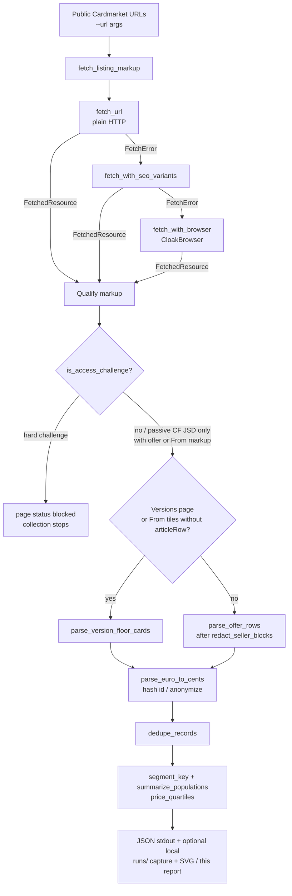
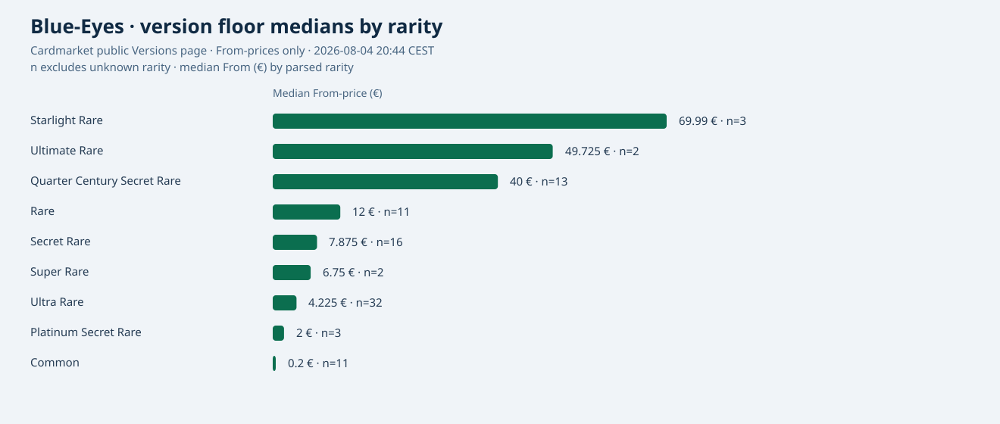

# Cardmarket Blue-Eyes market analysis report

Public, bounded snapshot of Cardmarket prices for **Blue-Eyes White Dragon** /
**Dragon Blanc aux Yeux Bleus**, collected with
[`examples/generic_cardmarket_blue_eyes.py`](../examples/generic_cardmarket_blue_eyes.py)
and the same evidence posture as the RTX dossier: reproducible commands,
separated populations, no seller identities, no raw HTML in git.

Workflow docs:
[`GENERIC_CARDMARKET_BLUE_EYES_EXAMPLE.md`](GENERIC_CARDMARKET_BLUE_EYES_EXAMPLE.md).

This report explains **how** the scraper produced the numbers below, not only
**what** the numbers were. Keep the two questions separate when you reuse the
figures.

## What this analysis can and cannot say

**It can say**

- On a given public page, at a given time, these displayed EUR prices were
  parseable after browser rendering.
- Version-floor tiles and live offer rows are different populations; each has
  its own counts and quartiles.
- Within one product URL, offers can be grouped by a five-field segment key
  (condition, language, rarity, edition, graded/raw).
- The pipeline stopped honestly on hard challenges and never logged in,
  solved CAPTCHA, or accepted tracking consent.

**It cannot say**

- “The” price of Blue-Eyes White Dragon as a single market number.
- The full Cardmarket inventory (only the first offer page per URL, ≤50 rows).
- That HTTP 200 was returned, or that the next run will succeed the same way.
- Seller reputations, private listings, deleted ads, or graded-card markets
  (this sample had **0** graded offers).
- Behaviour of the canonical FR hub
  `https://www.cardmarket.com/fr/YuGiOh/Cards/BlueEyes-White-Dragon` — that URL
  was **not** fetched in this run.

## Why Blue-Eyes has no single price

Blue-Eyes White Dragon is many products at once: different expansions, rarities,
print versions (V1, V2, …), languages, conditions, and editions. A Structure
Deck common at **0.02 €** and a 25th Anniversary Near Mint German offer around
**35 €** are both “Blue-Eyes” on Cardmarket, but they are not comparable.

Two populations must stay separate:

| Population | Where it comes from | What one row means |
| --- | --- | --- |
| `version_floor` | Versions overview tiles | Product-level **From** price for one version path — not a seller offer |
| `offer` | Product / card `article-row` blocks | One anonymized live listing on that page |

Averaging floors with offers, or merging offers across product URLs into one
median, silently invents a fake “Blue-Eyes price”. The example refuses that
merge in `summarize_populations()`.

## Run metadata

| Field | Value |
| --- | --- |
| Local time | **2026-08-04 20:44:41 CEST** (Europe/Paris) |
| UTC start | `2026-08-04T18:44:41.356387+00:00` |
| UTC end | `2026-08-04T18:45:39.287174+00:00` |
| Transport | CloakBrowser via `supersocks-url-scraper` (`x-fetch-method=cloak`) |
| Delay | 2.5 s between URLs |
| Post-load wait | 9 s |
| Login / CAPTCHA solve / consent accept | **not used** |
| Archive fallback | **disabled** |
| Private evidence dir | gitignored `runs/cardmarket-blue-eyes/` |

## Source URLs

1. `https://www.cardmarket.com/en/YuGiOh/Cards/Blue-Eyes-White-Dragon/Versions`
2. `https://www.cardmarket.com/en/YuGiOh/Cards/Blue-Eyes-White-Dragon`
3. `https://www.cardmarket.com/en/YuGiOh/Products/Singles/Rarity-Collection-5/Blue-Eyes-White-Dragon-V1-Ultra-Rare`
4. `https://www.cardmarket.com/en/YuGiOh/Products/Singles/Legend-of-Blue-Eyes-White-Dragon-25th-Anniversary-Edition/Blue-Eyes-White-Dragon`
5. `https://www.cardmarket.com/en/YuGiOh/Products/Singles/Structure-Deck-Blue-Eyes-White-Destiny/Blue-Eyes-White-Dragon-V1-Common`

An exploratory plain HTTP/SEO probe used the translated non-canonical FR slug
`/fr/YuGiOh/Cards/Dragon-Blanc-aux-Yeux-Bleus` and got a hard 403 without usable
markup. That probe is **not** evidence about the canonical FR hub
`https://www.cardmarket.com/fr/YuGiOh/Cards/BlueEyes-White-Dragon`, which was
**not** fetched in this run and is excluded from the conclusions below.

## Volume and failure rate

| Metric | Value |
| --- | ---: |
| Pages requested | 5 |
| Pages with parseable public markup | 5 |
| Pages `error` / hard `blocked` | 0 |
| Page failure rate | **0%** (0/5) |
| Version floor records raw → net | 175 → **175** |
| Offer rows raw → net | 200 → **200** |
| Graded offers detected | 0 |

Honest transport caveat: CloakBrowser returned usable HTML for every URL above,
but the embedded HTTP status on four product/card responses was **403** and the
Versions response was **429**. Plain `fetch_url` without browser was consistently
403. No DataDome/captcha interstitial stopped the run under the strict challenge
detector (passive Cloudflare JSD beacons alone were ignored when offer markup
was present). Rate limiting and bot scoring remain a real bias: this is a
short polite sample, not a full inventory crawl.

## Real pipeline (how the snapshot was built)

The example does **not** call the article-oriented `read_url()` helper (that
returns cleaned text). It uses the same raw fetch primitives as the package
reader, then parses HTML in memory.



### Step-by-step walkthrough (tied to real functions)

1. **`main()`** — CLI gathers `--url` list, `--delay-seconds` (default 2.5),
   `--browser-post-load-wait-ms` (default 9000), optional `--no-browser-fallback`.
2. **`collect_cardmarket_blue_eyes(urls, …)`** — bounds URL count to
   `1..MAX_URL_LIMIT` (20). Loops URLs with a polite sleep between pages.
3. **`fetch_listing_markup(url, …)`** — try order:
   - `fetch_url()` (desktop UA),
   - on `FetchError`: `fetch_with_seo_variants()`,
   - on failure: `fetch_with_browser(..., post_load_wait_ms=…)` when browser
     fallback is enabled.
   Warnings record which stage succeeded (`http` / SEO / `x-fetch-method=cloak`).
4. **Challenge / content qualification** — `is_access_challenge(markup)`.
   On hard challenge: page `status="blocked"`, warning, **`break`** (no further
   URLs). Otherwise continue.
5. **Route to parser** — if the URL contains `/Versions`, or markup has
   `From` tiles and no `articleRow`, call `parse_version_floor_cards()`;
   else `parse_offer_rows()`.
6. **Redaction before attributes** — offer chunks pass through
   `redact_seller_blocks()` so seller columns never feed tooltips or output.
7. **Normalization** — `parse_euro_to_cents()`, attribute picks via
   `tooltip_values()` / `pick_attr()`, Blue-Eyes filter
   `is_blue_eyes_target()` on version tiles.
8. **Anonymization** — SHA-256 truncated ids (`version_floor|…` or
   `offer|articleRow…`); offers also store `article_id_hash`, never seller names.
9. **Dedupe** — `dedupe_records()` by anonymized `id` within and across pages.
10. **Segmentation & stats** — `summarize_populations()` → per-source offer
    segments via `segment_key()`, rarity groups for floors, all via
    `price_quartiles()`.
11. **Publish** — JSON on stdout (status, counts, failure_rate, populations,
    pages, warnings). This public report and SVG keep **aggregates only**;
    any local stdout/HTML notes stay under gitignored `runs/`.

Archive fallback is intentionally unused: stale snapshots must not mix with
live prices.

## HTTP 403 / 429 with rendered content

Cardmarket’s edge often answers plain HTTP with **403**. CloakBrowser can still
return a `FetchedResource` whose body contains offer or version markup while
`status_code` remains **403** (products/card hub in this run) or **429**
(Versions page).

Read both facts together:

| Signal | Meaning here |
| --- | --- |
| Parseable markup | Enough public HTML was present to extract rows |
| Embedded 403 / 429 | The edge still scored the request as blocked or rate-limited |
| Page `status: ok` + `parsed > 0` | Extraction succeeded for that sample |
| Stable access | **Not** proven — the next polite run may fail or challenge |

So “parseable” ≠ “allowed forever”. The report keeps failure_rate at **0%**
because no page was `error`/`blocked` under the strict detector, while still
documenting hostile HTTP statuses.

## Challenge detector: strict markers vs passive Cloudflare beacon

`ACCESS_CHALLENGE_PATTERN` looks for hard markers, including:

- `geo.captcha-delivery.com`, DataDome, `cf-browser-verification`
- `cdn-cgi/challenge-platform/h/` (challenge **handler** path)
- phrases such as access denied / please verify you are a human / captcha

Separately, `PASSIVE_CF_JSD` matches
`cdn-cgi/challenge-platform/scripts/jsd/` — a common passive script beacon.

`is_access_challenge()` logic in plain terms:

1. No challenge-pattern hit → not a challenge.
2. Pattern hit, but offer/`From` markup is present **and** only the passive JSD
   beacon (no strong interstitial markers) → **not** treated as blocked.
3. Offer markup present but a **strong** marker is also present → blocked.
4. Otherwise → blocked; `collect_cardmarket_blue_eyes()` stops the loop.

The collector never solves CAPTCHA, never logs in, and never bypasses the wall.
Stopping is the designed behaviour.

## Mini example: synthetic offer in → anonymized record out

Sanitized illustration (not a live seller; ids are fake). Seller HTML is
stripped before parsing.

**Incoming fragment (synthetic)**

```html
<div id="articleRow1001" class="row g-0 article-row">
  <div class="col-seller"><a href="/en/YuGiOh/Users/example-seller">example-seller</a></div>
  <div class="col-product">
    <span data-bs-original-title="Near Mint" class="article-condition condition-nm"></span>
    <span data-bs-original-title="English" aria-label="English"></span>
    <span data-bs-original-title="First Edition" aria-label="First Edition"></span>
    <div class="price-container"><span>1,99 €</span></div>
  </div>
</div>
```

**Outgoing record shape (fields illustrated; hash values are examples)**

```json
{
  "id": "a1b2c3d4e5f60718",
  "record_kind": "offer",
  "article_id_hash": "9f8e7d6c5b4a",
  "title": "Blue-Eyes White Dragon",
  "price_eur": 1.99,
  "price_cents": 199,
  "language": "English",
  "condition": "Near Mint",
  "rarity": null,
  "edition": "First Edition",
  "expansion_code": null,
  "graded": false,
  "source_url": "https://www.cardmarket.com/en/YuGiOh/Products/Singles/…"
}
```

Notes:

- `rarity` may stay empty/`unknown` when the row tooltip omits it — the script
  does **not** invent Ultra Rare from the product URL for offers.
- `id` = first 16 hex chars of
  `sha256("offer|{articleRowId}|{cents}|{language}|…")`.
- `article_id_hash` = first 12 hex chars of `sha256(articleRowId)`.
- Seller name and profile URL never appear in the JSON.

Version floors similarly hash `version_floor|{product_path}|{cents}` and set
`record_kind` to `version_floor`.

## Parsing, anonymization, segments, and quartiles

### Version floors — `parse_version_floor_cards()`

- Finds product links under `/en/YuGiOh/Products/Singles/…`.
- Keeps tiles that match `is_blue_eyes_target()` (EN/FR name or slug tokens).
- Reads `From … €` and optional `N Available`.
- May infer rarity from the product slug (unlike offer rows).
- Emits one floor record per matching path.

### Offer rows — `parse_offer_rows()`

- Splits on `id="articleRow…"` / `article-row`.
- Runs `redact_seller_blocks()` first.
- Condition from `condition-nm` (etc.) or tooltips; language / rarity / edition
  from tooltips / `aria-label`.
- Price from `.price-container` via `parse_euro_to_cents()`.
- Graded if PSA/BGS/CGC/SGC grade tokens appear in text.

### EUR parsing — `parse_euro_to_cents()`

Accepts common EU/US forms (`1,99 €`, `1.99 €`, spaced thousands, optional EUR).
Converts to integer cents with half-up rounding, then `price_eur = cents / 100`.

### Dedupe — `dedupe_records()`

Keeps the first record per anonymized `id`. Raw → net in this run: floors
175 → 175, offers 200 → 200 (no duplicate ids after hashing).

### `unknown` attributes

Missing tooltips become `unknown` in the segment key (via
`row.get(field) or "unknown"`). That is intentional honesty, not a bug. Do not
backfill rarity from the URL for offers without an explicit attribute.

### Segment key — `segment_key()`

Five fields joined with `|` for tables:

`condition|language|rarity|edition|(graded|raw)`

Example: `Near Mint|English|unknown|First Edition|raw`.

### Stats — `price_quartiles()`

For a sorted series: **min**, **Q1** (p=0.25), **median** (p=0.5), **Q3**
(p=0.75), **max**, plus **n**.

Why median matters: Blue-Eyes floors run from **0.02 €** to **1999.99 €**. A
mean would be pulled by a few extreme tiles; the median (**5.00 €** for all
version floors) better describes the middle of the displayed distribution.
Page-level offer medians can still mix segments — prefer the segment tables.

## Population A — version floors (Versions page)

These are product-level **From** prices, one per version tile. They are **not**
offer rows and must not be averaged with live offers.

| Stat | EUR |
| --- | ---: |
| n | 175 |
| min | 0.02 |
| Q1 | 0.99 |
| median | **5.00** |
| Q3 | 19.995 |
| max | 1999.99 |
| Sum of displayed “Available” counts | 78,357 |

### Median From-price by parsed rarity

Unknown rarity (82 tiles whose slug/tooltip did not map cleanly) is excluded
from the chart so Common is not silently mixed with Starlight.



| Rarity | n | Median From (€) |
| --- | ---: | ---: |
| Starlight Rare | 3 | 69.99 |
| Ultimate Rare | 2 | 49.725 |
| Quarter Century Secret Rare | 13 | 40.00 |
| Rare | 11 | 12.00 |
| Secret Rare | 16 | 7.875 |
| Super Rare | 2 | 6.75 |
| Ultra Rare | 32 | 4.225 |
| Platinum Secret Rare | 3 | 2.00 |
| Common | 11 | 0.20 |
| unknown (excluded from SVG) | 82 | 3.87 |

## Population B — live offers (kept per source URL)

Each product page exposed 50 `article-row` offers (first result page only).
Seller names were redacted. Stats below are **not** merged across products.

### Rarity Collection 5 — V1 Ultra Rare

URL: product page (3) above.

| Segment (`condition\|language\|rarity\|edition\|(graded\|raw)`) | n | min | Q1 | median | Q3 | max |
| --- | ---: | ---: | ---: | ---: | ---: | ---: |
| Near Mint \| English \| unknown\* \| First Edition \| raw | 20 | 1.00 | 1.82 | **1.99** | 2.00 | 2.45 |
| Near Mint \| English \| unknown\* \| unknown \| raw | 9 | 1.40 | 1.50 | 2.00 | 2.00 | 2.41 |
| Near Mint \| French \| unknown\* \| First Edition \| raw | 8 | 1.50 | 2.00 | 2.00 | 2.10 | 2.45 |

\*Product page rarity icon sometimes omitted in the row tooltip even though the
URL is the Ultra Rare product; do not relabel without an explicit attribute.

Page-level median (mixed segments on that page): **2.00 €** (n=50).

### Legend of Blue-Eyes White Dragon — 25th Anniversary Edition

| Segment | n | min | Q1 | median | Q3 | max |
| --- | ---: | ---: | ---: | ---: | ---: | ---: |
| Near Mint \| German \| unknown \| unknown \| raw | 21 | 22.00 | 27.95 | **35.50** | 41.64 | 50.00 |
| Near Mint \| English \| unknown \| unknown \| raw | 15 | 30.00 | 47.08 | **48.75** | 49.97 | 50.00 |
| Excellent \| English \| unknown \| unknown \| raw | 5 | 36.71 | 44.99 | 44.99 | 46.78 | 47.99 |

Page-level median: **40.82 €** (n=50). This population is incompatible with
Structure Deck commons or modern Ultra Rare reprints.

### Structure Deck: Blue-Eyes White Destiny — V1 Common

| Segment | n | min | median | max |
| --- | ---: | ---: | ---: | ---: |
| Near Mint \| French \| unknown \| First Edition \| raw | 17 | 0.02 | **0.02** | 0.02 |
| Near Mint \| English \| unknown \| First Edition \| raw | 10 | 0.02 | **0.02** | 0.02 |
| Near Mint \| German \| unknown \| First Edition \| raw | 8 | 0.02 | **0.02** | 0.02 |

Page-level median: **0.02 €** (n=50).

### Card hub offers page

URL (2) returned 50 offers. Dominant segment:

| Segment | n | median |
| --- | ---: | ---: |
| Near Mint \| English \| Ultra Rare \| First Edition \| raw | 19 | **1.99 €** |

Useful as a cross-check, but the hub can reshuffle mixed products; prefer
explicit product URLs for claims.

## Private audit trail and verification chain

The example keeps raw HTML **in memory only** and prints anonymized JSON to
stdout. It does not commit cookies, tokens, browser profiles, or page dumps.

Operators may capture stdout (and any local notes) under the gitignored
`runs/` tree — this run used `runs/cardmarket-blue-eyes/`. That directory is
the **private audit ledger**: enough to re-check counts and warnings locally,
never published in the repository.

Verification layers (keep them distinct):

| Layer | What it proves | What it does not prove |
| --- | --- | --- |
| Live snapshot in this report | Dated aggregates from the 2026-08-04 CEST run | Tomorrow’s market or HTTP friendliness |
| Private `runs/` capture | Operator can re-open local JSON/notes | Nothing shareable by itself |
| `tests/test_generic_cardmarket_blue_eyes.py` | Parsers, redaction, quartiles, challenge stop, URL bounds on **synthetic** HTML | Live Cardmarket behaviour |

Offline fixtures are synthetic only. Passing pytest does not mean a live URL
fetch succeeded.

## How to read the results (and common mistakes)

1. Start with `status`, `failure_rate`, and per-page `parsed` / `http_status` —
   not the pretty medians alone.
2. Compare **segments within one product URL**, not a global Blue-Eyes average.
3. Treat version-floor medians and offer medians as different instruments.
4. `unknown` rarity on an Ultra Rare product page means the **row** lacked the
   attribute — do not silently promote it.
5. Hub page (URL 2) is a cross-check; product URLs own the claim.
6. First-page bias: Cardmarket sort/filters choose which ≤50 offers you see.
7. Do not cite the non-canonical FR slug probe as proof about the canonical FR
   hub that was never fetched.

## What was verified offline

`tests/test_generic_cardmarket_blue_eyes.py` covers:

- EUR parsing / normalization
- offer parsing with seller redaction
- version-floor parsing and Blue-Eyes filtering
- deduplicated population summaries that refuse silent cross-product merges
- quartiles
- challenge detection (passive CF JSD vs hard interstitial)
- stop-on-challenge collection behaviour
- URL count bounds

Fixtures are synthetic HTML only.

## Biases and limits

1. **First page only** per URL (≤50 offers). Deeper pagination was not crawled.
2. **Cloudflare 403/429** on browser responses — content was present, but the
   edge is hostile; repeats may fail.
3. **Attribute gaps** — language/rarity/edition come from tooltips; missing
   tooltips stay `unknown` instead of being guessed from the URL alone for
   offers (version floors may infer rarity from the product slug).
4. **No graded cards** in this sample.
5. **Sorting / filters** on Cardmarket affect which 50 offers appear.
6. **Not the site’s full inventory** — private, deleted, or unpriced listings
   are out of scope.
7. **Legal/ToS** — operator must stay within Cardmarket terms, robots/rate
   expectations, and local law. This repository ships a scraper pattern, not a
   bypass service.

## Reproduction and polite troubleshooting

```bash
python -m venv .venv && . .venv/bin/activate
pip install -e '.[full,browser,test]'
python -m pytest tests/test_generic_cardmarket_blue_eyes.py -q
python examples/generic_cardmarket_blue_eyes.py \
  --url 'https://www.cardmarket.com/en/YuGiOh/Cards/Blue-Eyes-White-Dragon/Versions' \
  --url 'https://www.cardmarket.com/en/YuGiOh/Cards/Blue-Eyes-White-Dragon' \
  --url 'https://www.cardmarket.com/en/YuGiOh/Products/Singles/Rarity-Collection-5/Blue-Eyes-White-Dragon-V1-Ultra-Rare' \
  --url 'https://www.cardmarket.com/en/YuGiOh/Products/Singles/Legend-of-Blue-Eyes-White-Dragon-25th-Anniversary-Edition/Blue-Eyes-White-Dragon' \
  --url 'https://www.cardmarket.com/en/YuGiOh/Products/Singles/Structure-Deck-Blue-Eyes-White-Destiny/Blue-Eyes-White-Dragon-V1-Common' \
  --delay-seconds 2.5 \
  --browser-post-load-wait-ms 9000
```

Redirect stdout to a path under gitignored `runs/` if you want a private copy.
Live totals will drift; compare structure and segment discipline, not exact
euro values.

| Symptom | Polite response |
| --- | --- |
| Plain HTTP 403 | Expected; keep browser fallback enabled |
| Browser HTML usable but status 403/429 | Document both; do not claim stable access |
| Empty parse / `partial` | Check warnings; lengthen `--browser-post-load-wait-ms` slightly; keep delay ≥ 2.5 s |
| `blocked` / access challenge | Stop. Do not add CAPTCHA solve, login, or bypass |
| Want more offers | Out of scope for this bounded example (first page only) |

No CAPTCHA solving, no login, no consent acceptance, no challenge bypass.

## Short glossary

| Term | Meaning |
| --- | --- |
| Version floor | Product tile **From** price on the Versions overview |
| Offer row | One live `article-row` listing after seller redaction |
| Segment key | `condition\|language\|rarity\|edition\|graded\|raw` grouping |
| CloakBrowser | Optional browser fetch path (`fetch_with_browser`) |
| Passive CF JSD | Cloudflare `…/scripts/jsd/` beacon; not a hard block alone |
| Hard challenge | Interstitial / delivery markers that stop collection |
| count_raw / count_net | Sum of per-page parsed rows vs deduped record lists |
| Private ledger | Local gitignored `runs/…` capture; not shipped in git |
