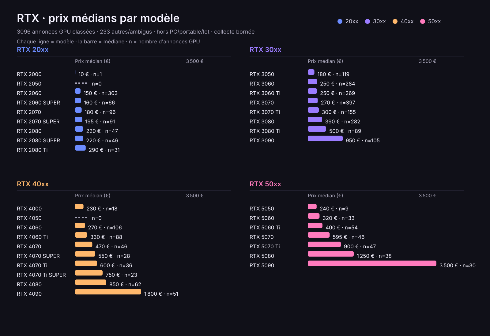

# Case study: RTX prices

Public, share-safe case study showing how `supersocks-url-scraper` collects
structured RTX listing prices from an operator-owned / placeholder marketplace
pattern, then how a sanitized aggregate snapshot is reconciled. No real
marketplace name, domain, live URL, listing identifier, cookie, token, raw HTML,
or browser profile is included in the repository.

## Objectif

Demonstrate a bounded, reproducible price-extraction pattern on dynamic search
pages that embed listing records in JSON, then publish only aggregate model-level
counts and medians. The workflow must:

- reuse the package HTTP → SEO → browser fetch primitives (not a bypass service);
- keep target URLs and field mappings local;
- filter RTX titles, normalize EUR prices, deduplicate by listing id;
- stop on access challenges rather than work around them;
- leave raw pages, IDs, titles, and ledgers under gitignored `runs/`.

Companion code: [`examples/generic_rtx_prices.py`](../examples/generic_rtx_prices.py).

## Parcours du scraper

### Install

```bash
python -m venv .venv
. .venv/bin/activate
pip install -e '.[full,browser,test]'
```

The `browser` extra installs CloakBrowser support for dynamic pages. If the
target page is static and exposes embedded JSON to plain HTTP, pass
`--no-browser-fallback`.

This structured example calls the reader's raw HTTP/SEO/browser fetch primitives
because the article-oriented `read_url` contract intentionally returns cleaned
text. The raw markup is parsed in memory and is never written to the repository.

### Placeholder command

Use an operator-owned placeholder URL template with a `{page}` token. Keep
pagination bounded and add a delay between pages:

```bash
python examples/generic_rtx_prices.py \
  --url-template 'https://marketplace.invalid/search?q=rtx&page={page}' \
  --max-pages 3 \
  --delay-seconds 2 \
  --browser-post-load-wait-ms 8000
```

`marketplace.invalid` is a placeholder only. Replace it locally with a URL you
are allowed to query; do not commit real target URLs or fetched page content.

### Embedded JSON shape

By default the example reads a non-executed JSON script isolated by id:

```html
<script id="RTX_PRICE_DATA" type="application/json">
{
  "items": [
    {"id": "synthetic-1", "title": "Generic RTX 4070", "price": "599 €", "currency": "EUR", "url": "/listing/synthetic-1"}
  ]
}
</script>
```

The script does not infer marketplace-specific state from arbitrary JavaScript.
If your page uses different field names, provide a local config file:

```json
{
  "script_id": "__NEXT_DATA__",
  "items_path": ["props", "pageProps", "searchData", "ads"],
  "id_field": "list_id",
  "title_field": "subject",
  "price_field": "price_cents",
  "price_unit": "cents",
  "currency_field": "",
  "url_field": "url"
}
```

Run with `--config /path/to/local-config.json`. Do not commit a config containing
real marketplace details if it reveals private targets.

For a page whose embedded records expose a major-unit price instead, use
`"price_field": "price"`, `"price_unit": "major"`, and either a per-record
`"currency_field"` or `"default_currency": "EUR"`. One-value arrays such as
`[360]` are accepted and reduced to their first scalar value.

### Procedure for the dynamic search page

1. Create the mapping above in a local file such as `/tmp/rtx-price-config.json`.
2. Put the allowed search URL in a shell variable; keep the real value out of
   Git and out of screenshots or copied logs.
3. Add the page token to the URL and run a bounded scan. For a complete result
   set, choose the page limit exposed by the target and keep a polite delay:

```bash
export SEARCH_URL='https://marketplace.invalid/search?q=rtx'
python examples/generic_rtx_prices.py \
  --url-template "${SEARCH_URL}?page={page}" \
  --config /tmp/rtx-price-config.json \
  --max-pages 100 \
  --delay-seconds 2 \
  --browser-post-load-wait-ms 8000 \
  > /tmp/rtx-prices.json
```

4. Read `status`, `count`, `pages`, and `warnings` before using the prices.
`ok` means at least one deduplicated RTX record was extracted; `partial` means
the pages were reachable but one or more records/pages were not usable; `error`
means no page could be fetched. Never treat a non-empty file alone as proof of
complete coverage. When the markup looks like an access challenge, the current
page is marked `blocked` and pagination stops; the overall result is `partial`.

5. If the page needs login, CAPTCHA solving, an acceptance click, or a control
that is not an explicit refusal/continue-without-accepting action, stop the run
and review it manually. This example does not bypass those controls.

### Output contract

The command prints JSON:

- `status: "ok"` when at least one RTX listing with an EUR price was extracted.
- `status: "partial"` when pages were fetched but no usable listing was extracted, when some pages could not expose the configured JSON, or when an access challenge stops pagination.
- `status: "error"` when all page reads failed.
- `listings[]` contains deduplicated objects: `id`, `title`, `price_eur`, `price_cents`, `page`, and optional `relative_url`.
- `pages[]` records page number, status, fetch method, and URL template expansion.
- `warnings[]` records extraction/fetch caveats.

The example filters titles containing an RTX token, converts common euro formats such as `1 234,56 €`, `EUR 1,299.00`, and configured major/cents numeric values, and deduplicates by the configured listing id.

### Dynamic pages and consent guard

With browser fallback enabled, the existing runtime follows the same HTTP → SEO → browser pipeline as the package reader. During browser rendering it may close a recognized cookie/consent window only when it finds an explicit refusal or continuation-without-accepting control, for example `Tout refuser`, `Reject all`, or `Continuer sans accepter`.

It never clicks arbitrary buttons and never clicks acceptance labels. If the page requires login, CAPTCHA solving, subscription access, or accepting tracking, stop and handle that outside this example according to the site terms.

### What the reconciled nationwide snapshot actually ran

The aggregate snapshot below used a shared, local CloakBrowser context directly.
It did not claim that the generic HTTP → SEO → browser fallback was exercised:
the browser route was selected intentionally so every shard and pass used the
same transport and produced comparable saved pages.

1. Synthetic tests first covered a complete shard, probe failure, missing page,
   explicit zero-result shard, moving totals/identifiers, checkpoint resume,
   and the high-price queue.
2. A nationwide category query was split recursively by displayed EUR price
   until every shard fit within the public pagination limit.
3. Every expected page was rendered with an explicit two-second inter-page
   delay. Embedded JSON was extracted in memory, EUR prices were normalized,
   and records were deduplicated by listing identifier.
4. Raw pages, hashes, ledgers, checkpoints, IDs, and titles stayed under the
   gitignored `runs/` directory. Existing raw pages were never overwritten.
5. Two complete passes were compared by identifier and by shard. Because the
   live inventory changed, only the three divergent shards were read a third
   time; that last complete reading became canonical for those shards.
6. A separate recomputation rebuilt the canonical ID set from raw HTML, matched
   all 3,404 identifiers exactly, excluded contamination flags, recalculated
   quartiles and medians, generated the SVG twice, and verified byte-stable
   output plus table/SVG agreement.

No login, CAPTCHA solving, consent acceptance, archive fallback, or access-
challenge bypass was used. The collector is configured to stop rather than
work around an access challenge.

## Limites

- Keep `--max-pages` bounded; the script enforces `1..100`.
- Use `--delay-seconds` to respect the target's rhythm.
- No cookies, tokens, browser profiles, fetched HTML, or live results are written by this example.
- Archive fallback is disabled for this price example to avoid mixing stale snapshots with price data.
- The script is an extraction pattern, not a bypass service. Use only on pages you are allowed to query and comply with terms, robots/rate expectations, copyright, and local law.
- Exact-model matching prefers the most specific token (`Ti SUPER`, then `SUPER`, then `Ti`, then the base model). The classifier is intentionally conservative, but title heuristics can still over-flag or under-flag.
- Prices such as 1 € and other outliers remain in the dataset; medians reduce their effect but do not turn a listing title into a verified standalone GPU.
- This is not the marketplace's internal inventory: unpriced, deleted while collecting, private, or miscategorized ads cannot be guaranteed by a public search collector.

## Résultats

### Reconciled snapshot

- Run date: 2026-08-01
- Result: `reconciled public snapshot`
- Scope: nationwide public graphics-card category search, with no geographic
  filter
- Price coverage: six non-overlapping shards (`0–312`, `313–625`, `626–1,250`,
  `1,251–2,500`, `2,501–5,000`, and `5,001–max` EUR)
- Pass 1: 129/129 pages valid, 3,396 unique priced RTX records
- Pass 2: 129/129 pages valid, 3,396 unique priced RTX records
- Pass 1 versus pass 2: 3,350 shared identifiers, 46 only in each pass
- Pass 3: 110/110 pages valid on the three moving shards
- Canonical snapshot: 3,404 unique priced RTX records, using pass 2 for stable
  shards and the later pass 3 for moving shards
- One transient browser network failure was retained in the audit ledger and
  retried successfully; no access challenge was detected
- 3,321 records remained after excluding titles flagged as complete PC, laptop,
  bundle/lot, or multi-model; 3,096 were classified to one exact RTX model
- GPU-only price quartiles: Q1 200 €, median 290 €, Q3 450 €

This is the complete reconciled snapshot of the public, priced, category-scoped
results exposed during the bounded run.

### Classification exceptions

Flags can overlap.

| Bucket | Count |
| --- | ---: |
| Any excluded contamination flag | 83 |
| Complete-PC token | 44 |
| Laptop token | 1 |
| Bundle/lot token | 31 |
| Multi-model title | 22 |
| Ambiguous RTX token | 160 |
| No exact model match | 233 |
| Exact model match but contaminated | 75 |

### Model-level view (GPU-only)

The graph shows the median displayed price for each exact RTX model after
excluding titles flagged as complete PCs, laptops, bundles/lots, or multiple
models. `n` is the number of retained records. A zero row means no retained
hit for that exact model during the snapshot.



| Generation | Model | Records (GPU-only) | Median |
| --- | --- | ---: | ---: |
| 20xx | RTX 2000 | 1 | 10 € |
| 20xx | RTX 2050 | 0 | — |
| 20xx | RTX 2060 | 303 | 150 € |
| 20xx | RTX 2060 SUPER | 66 | 160 € |
| 20xx | RTX 2070 | 96 | 180 € |
| 20xx | RTX 2070 SUPER | 91 | 195 € |
| 20xx | RTX 2080 | 47 | 220 € |
| 20xx | RTX 2080 SUPER | 46 | 220 € |
| 20xx | RTX 2080 Ti | 31 | 290 € |
| 30xx | RTX 3050 | 119 | 180 € |
| 30xx | RTX 3060 | 284 | 250 € |
| 30xx | RTX 3060 Ti | 269 | 250 € |
| 30xx | RTX 3070 | 397 | 270 € |
| 30xx | RTX 3070 Ti | 155 | 300 € |
| 30xx | RTX 3080 | 282 | 390 € |
| 30xx | RTX 3080 Ti | 89 | 500 € |
| 30xx | RTX 3090 | 105 | 950 € |
| 40xx | RTX 4000 | 18 | 230 € |
| 40xx | RTX 4050 | 0 | — |
| 40xx | RTX 4060 | 106 | 270 € |
| 40xx | RTX 4060 Ti | 88 | 330 € |
| 40xx | RTX 4070 | 46 | 470 € |
| 40xx | RTX 4070 SUPER | 28 | 550 € |
| 40xx | RTX 4070 Ti | 36 | 600 € |
| 40xx | RTX 4070 Ti SUPER | 23 | 750 € |
| 40xx | RTX 4080 | 62 | 850 € |
| 40xx | RTX 4090 | 51 | 1,800 € |
| 50xx | RTX 5050 | 9 | 240 € |
| 50xx | RTX 5060 | 33 | 320 € |
| 50xx | RTX 5060 Ti | 54 | 400 € |
| 50xx | RTX 5070 | 46 | 595 € |
| 50xx | RTX 5070 Ti | 47 | 900 € |
| 50xx | RTX 5080 | 38 | 1,250 € |
| 50xx | RTX 5090 | 30 | 3,500 € |

All displayed medians are rounded half-up to whole euros. Quartiles are
calculated from raw EUR values. The public graph and table contain aggregates
only; the reproducible private evidence remains gitignored.

## Reproduction

```bash
python -m venv .venv && . .venv/bin/activate
pip install -e '.[full,browser,test]'
python -m pytest tests/test_generic_rtx_prices.py -q
python examples/generic_rtx_prices.py \
  --url-template 'https://marketplace.invalid/search?q=rtx&page={page}' \
  --max-pages 3 \
  --delay-seconds 2 \
  --browser-post-load-wait-ms 8000
```

Replace the placeholder URL locally with a page you are allowed to query.
Redirect stdout under gitignored `runs/` if you need a private copy. Live totals
will drift; compare structure and status/`warnings` discipline, not exact euro
values.

| Symptom | Polite response |
| --- | --- |
| Plain HTTP fails on a dynamic page | Keep browser fallback enabled |
| Access challenge / `blocked` page | Stop. Do not add CAPTCHA solve, login, or bypass |
| `partial` with empty listings | Check warnings and config field paths |
| Want nationwide coverage | Split by price shards as in the reconciled run; keep polite delays |

No CAPTCHA solving, no login, no consent acceptance, no challenge bypass.
